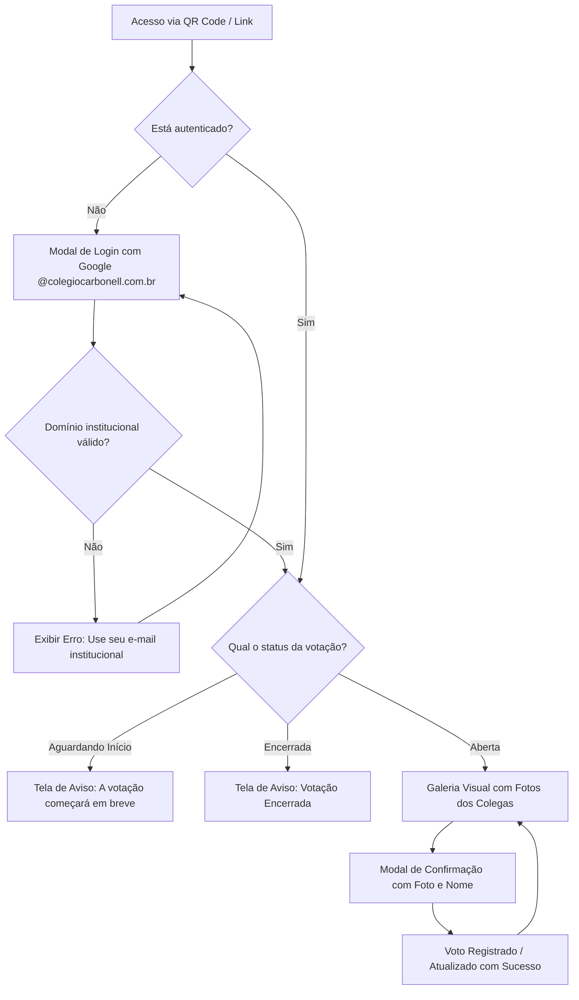

# PRD - Sistema de Votação da Melhor Fantasia

**Organização:** Colégio Carbonell  
**Evento:** Festa de Confraternização  
**Versão:** 1.0  
**Status:** Aprovado e Implementado  

---

## 1. Contexto e Visão Geral

### 1.1 Problema
Nas festas de confraternização anteriores, a votação para a melhor fantasia enfrentava um grande obstáculo prático: os colaboradores frequentemente **não sabiam o nome da pessoa fantasiada**. Isso causava abstenções, dúvidas na hora de preencher cédulas ou formulários tradicionais e votos perdidos para pessoas com nomes parecidos.

### 1.2 Solução
Uma aplicação web mobile-first interativa e visual. Antes da festa, as fotos de rosto de todos os colaboradores são previamente cadastradas. Durante o evento, cada funcionário acessa o sistema pelo smartphone, reconhece os colegas visualmente em uma galeria de fotos em tempo real e vota com apenas um toque.

---

## 2. Perfis de Usuário (Personas)

| Perfil | Descrição | Permissões |
| :--- | :--- | :--- |
| **Colaborador (Eleitor & Candidato)** | Funcionário da instituição com conta institucional Google Workspace. | • Autenticar com conta `@colegiocarbonell.com.br`.<br>• Visualizar a galeria com fotos de todos os colegas.<br>• Buscar por nome ou personagem.<br>• Emitir 1 voto e alterar sua escolha enquanto a votação estiver aberta. |
| **Administrador (Comissão da Festa)** | Membros da comissão organizadora definidos por lista de e-mails autorizados. | • Todas as permissões do Colaborador.<br>• Abrir, pausar e encerrar a votação manualmente.<br>• Acompanhar a apuração e gráficos em tempo real.<br>• Sincronizar fotos da pasta do servidor.<br>• Projetar a tela de Revelação dos Vencedores (Modo Telão/Palco). |

---

## 3. Requisitos Funcionais (RF)

### 3.1 Autenticação e Domínio Institucional
* **RF01 - Login Google Workspace:** A autenticação é restrita exclusivamente ao domínio `@colegiocarbonell.com.br`. Qualquer tentativa com e-mail pessoal (`@gmail.com`) ou externo é bloqueada imediatamente com aviso em tela.
* **RF02 - Rastreabilidade de Sessão:** O sistema gera um token JWT de sessão contendo nome, e-mail institucional e flag de administrador.
* **RF03 - Controle de Acesso Admin:** Rotas de administração (`/api/admin/*`, tela de métricas e controle de status) são restritas à lista configurada em `ADMIN_EMAILS`.

### 3.2 Cadastro e Reconhecimento dos Participantes
* **RF04 - Cadastro Prévio por Fotos:** As fotos de rosto dos colaboradores são adicionadas à pasta `server/photos/` antes da festa.
* **RF05 - Sincronização Inteligente por Nome de Arquivo:** O sistema extrai automaticamente o Nome e o E-mail através dos padrões:
  * `Nome Completo - email@colegiocarbonell.com.br.jpg` (Padrão Oficial)
  * `email@colegiocarbonell.com.br.jpg`
  * `Nome Sobrenome.jpg` (gera `nome.sobrenome@colegiocarbonell.com.br`)
* **RF06 - Galeria com Busca Rápida:** Grid responsivo de cards com fotos grandes, nome do colega, departamento e campo de busca instantânea (busca por nome ou fantasia).

### 3.3 Regras de Negócio da Votação
* **RF07 - Voto Único por Colaborador:** Cada colaborador autenticado tem direito a exatamente **1 voto ativo**.
* **RF08 - Alteração de Voto Permitida:** Enquanto a votação estiver no status `ABERTA`, o colaborador pode alterar seu voto para outro colega caso mude de ideia. Ao confirmar, o voto anterior é substituído de forma atômica.
* **RF09 - Permissão de Auto-voto:** O colaborador **pode votar em si mesmo** se desejar. O único limite do sistema é a regra de exatamente **1 voto ativo** por colaborador (voto único com permissão de alteração).
* **RF10 - Modal de Confirmação:** Ao clicar para votar ou alterar, abre-se um modal destacando a foto e o nome da pessoa escolhida, solicitando confirmação explícita.
* **RF11 - Feedback de Escolha:** O card do colega atualmente votado recebe destaque visual imediato com borda dourada e etiqueta `"Seu Voto Atual"`.

### 3.4 Ciclo de Vida da Votação
* **RF12 - Estados da Votação:**
  1. `Aguardando Início`: Mensagem de aviso informando que a votação começará em breve. Votos bloqueados.
  2. `Votação Aberta`: Votação e alteração de votos liberadas para todos os colaboradores.
  3. `Votação Encerrada`: Bloqueio total de novos votos e alterações. Mensagem orientando a acompanhar o telão.
* **RF13 - Controle Manual:** Abertura e encerramento são disparados manualmente pelos botões do painel do Administrador.

### 3.5 Painel de Apuração e Modo Telão (Projetor/Palco)
* **RF14 - Apuração em Tempo Real (Privada):** Apenas administradores visualizam o total de votos apurados, taxa de participação e ranking decrescente com porcentagens.
* **RF15 - Modo Telão / Pódio (`/revelacao`):**
  * Interface cinematográfica com tema escuro e detalhes em ouro para exibição em projetor ou painel de LED.
  * Pódio com 3º, 2º e 1º lugares.
  * Controle passo a passo para o apresentador do evento:
    * Botão 1: Revelar 3º Lugar 🥉 (Bronze) com suspense sonoro.
    * Botão 2: Revelar 2º Lugar 🥈 (Prata).
    * Botão 3: Revelar o **Grande Campeão 🥇👑** (Ouro) com fanfarra e chuva de confetes virtuais em tela cheia.

---

## 4. Requisitos Não-Funcionais (RNF)

* **RNF01 - Usabilidade Mobile-First:** Interface pensada para telas de 360px a 430px (smartphones iOS e Android via Chrome/Safari).
* **RNF02 - Baixa Carga de Dados e Cache:** Carregamento otimizado de imagens e fallback automático com avatares vetoriais caso uma imagem demore a carregar no 4G/Wi-Fi da festa.
* **RNF03 - Baixa Latência e Tolerância a Picos:** Arquitetura leve com polling assíncrono para suportar dezenas de colaboradores votando simultaneamente na abertura da urna.
* **RNF04 - Facilidade de Acesso:** Acesso direto via QR Code impresso nas mesas da festa.

---

## 5. Fluxo do Usuário (User Flow)



---

## 6. Arquitetura Técnica

```
votacao-confra/
├── PRD.md                      # Documento de Requisitos do Produto
├── README.md                   # Manual de instalação e operação
├── package.json                # Orquestrador com Concurrently
├── server/                     # Backend Node.js / Express
│   ├── index.js                # Servidor e rotas da API
│   ├── db.js                   # Persistência atômica dos votos e candidatos
│   ├── routes/                 # auth.js, vote.js, admin.js
│   ├── services/               # candidateSync.js (leitura de fotos)
│   ├── photos/                 # Diretório de fotos dos colaboradores
│   └── data/                   # Arquivo db.json
└── client/                     # Frontend React + Vite + Tailwind CSS
    ├── src/
    │   ├── App.jsx             # Gerenciador global de estado e abas
    │   ├── api.js              # Cliente HTTP com interceptor de token
    │   ├── components/         # Navbar, CandidateCard, VoteModal, LoginModal
    │   └── pages/              # VotingPage, AdminPage, RevealPage (Telão)
    └── vite.config.js          # Configuração do Vite e proxy reverso para a API
```

---

## 7. Roteiro Operacional para o Dia da Festa

1. **Antes do início:**
   * Garantir que todas as fotos estejam na pasta `server/photos/` e clicar em **"Sincronizar Fotos"**.
   * Manter a votação no status **"Aguardando Início"**.
   * Posicionar plaquinhas com o QR Code nas mesas.
2. **Durante a festa:**
   * O cerimonial anuncia o início da votação no microfone.
   * O administrador clica em **"Abrir Votação"** no painel `/admin`.
   * Os colaboradores votam pelo celular. A comissão acompanha o total de votos ao vivo.
3. **Encerramento e Apuração:**
   * O cerimonial faz a contagem regressiva e o administrador clica em **"Encerrar Votação"**.
   * O computador conectado ao projetor/telão abre o **"Modo Telão"** (`/revelacao`).
   * Anunciar e revelar o 3º, 2º e 1º colocados com a chuva de confetes!
