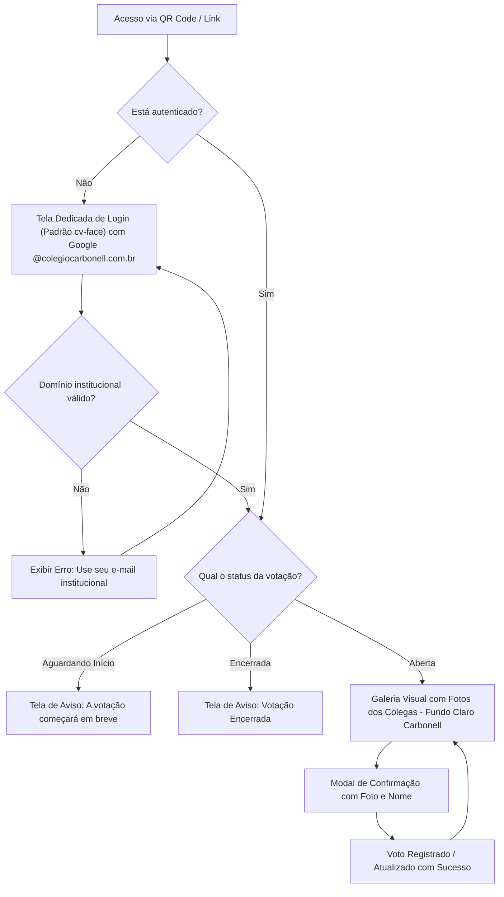

# PRD - Sistema de Votação do Melhor Traje

**Organização:** Colégio Carbonell  
**Evento:** Festa de Confraternização  
**Versão:** 2.0 (Identidade Visual Institucional Carbonell)  
**Status:** Aprovado  

---

## 1. Contexto e Visão Geral

### 1.1 Problema
Nas festas de confraternização anteriores, a votação para o melhor traje enfrentava um grande obstáculo prático: os colaboradores frequentemente **não sabiam o nome da pessoa caracterizada com o traje**. Isso causava abstenções, dúvidas na hora de preencher cédulas ou formulários tradicionais e votos perdidos para pessoas com nomes parecidos.

### 1.2 Solução
Uma aplicação web mobile-first interativa e visual. Antes da festa, as fotos de rosto de todos os colaboradores são previamente cadastradas. Durante o evento, cada funcionário acessa o sistema pelo smartphone, reconhece os colegas visualmente em uma galeria de fotos em tempo real e vota com apenas um toque.

### 1.3 Alinhamento de Marca e Identidade Visual
A aplicação adota formalmente o padrão de Identidade Visual e Design System do Colégio Carbonell (definido em [DESIGN_SYSTEM_PRD.md](file:///c:/Users/thiago.luiz/Desktop/Desenvolvimento/votacao-confra/DESIGN_SYSTEM_PRD.md)), espelhado nas diretrizes institucionais do LMS Colégio Carbonell.

---

## 2. Perfis de Usuário (Personas)

| Perfil | Descrição | Permissões |
| :--- | :--- | :--- |
| **Colaborador (Eleitor & Candidato)** | Funcionário da instituição com conta institucional Google Workspace. | • Autenticar com conta `@colegiocarbonell.com.br`.<br>• Visualizar a galeria com fotos de todos os colegas em cards brancos institucionais.<br>• Buscar por nome ou personagem.<br>• Emitir 1 voto e alterar sua escolha enquanto a votação estiver aberta.<br>• Visualização restrita: não tem acesso e não visualiza as abas de Admin e Telão. |
| **Administrador (Comissão da Festa)** | Membros designados da comissão organizadora:<br>1. `thiago.luiz@colegiocarbonell.com.br`<br>2. `patricia.santos@colegiocarbonell.com.br`<br>3. `marina.ribeiro@colegiocarbonell.com.br`<br>4. `raquel.favatto@colegiocarbonell.com.br`<br>5. `caroline.costa@colegiocarbonell.com.br` | • Todas as permissões do Colaborador.<br>• Visualização e acesso exclusivo às abas de **Admin** e **Telão** na barra de navegação.<br>• Abrir, pausar e encerrar a votação manualmente no painel administrativo.<br>• Acompanhar a apuração e gráficos em tempo real.<br>• Sincronizar fotos da pasta do servidor.<br>• Projetar a tela de Revelação dos Vencedores (Modo Telão/Palco) com identidade Carbonell. |

---

## 3. Requisitos Funcionais (RF)

### 3.1 Autenticação e Domínio Institucional
* **RF01 - Login Google Workspace:** A autenticação é restrita exclusivamente ao domínio `@colegiocarbonell.com.br`. Qualquer tentativa com e-mail pessoal (`@gmail.com`) ou externo é bloqueada imediatamente com aviso em tela.
* **RF02 - Rastreabilidade de Sessão:** O sistema gera um token JWT de sessão contendo nome, e-mail institucional e flag de administrador (`isAdmin`), com validade de 24 horas para cobrir com segurança toda a extensão da confraternização e madrugada sem expiração de sessão.
* **RF03 - Controle de Acesso Admin & Telão (RBAC Estrito):** 
  * Apenas os 5 e-mails pré-definidos (`thiago.luiz@colegiocarbonell.com.br`, `patricia.santos@colegiocarbonell.com.br`, `marina.ribeiro@colegiocarbonell.com.br`, `raquel.favatto@colegiocarbonell.com.br`, `caroline.costa@colegiocarbonell.com.br`) recebem a flag `isAdmin: true`.
  * As abas e botões de navegação para **Admin** e **Telão** são visíveis exclusivamente para os usuários administradores autenticados.
  * Todas as rotas de administração (`/api/admin/*`, tela de métricas, controles de status e sincronização) são estritamente bloqueadas no backend com código HTTP 403 para qualquer outro colaborador.
  * A tela de projeção do Modo Telão (`/revelacao`) exige privilégios de administrador para ser acessada ou renderizada.
* **RF03.1 - Tela de Login Obrigatória Antecedente (Gating de Fotos e Dados):**
  * A aplicação web proíbe terminantemente a exibição antecipada da galeria de fotos, nomes dos colegas ou informações de candidatos para usuários não autenticados.
  * Ao carregar a página inicial (seja por link direto ou leitura de QR Code), qualquer usuário sem sessão ativa é direcionado e retido em uma tela de login dedicada de página inteira (`LoginPage`), com layout idêntico e padronizado com o projeto `cv-face` (layout centralizado vertical e horizontalmente, logotipo institucional oficial `logo-fundo-branco.png` / `logo2.png`, título "Votação do Melhor Traje", mensagem instrutiva e botão institucional de login Google).
  * A barra de navegação (`Navbar`) e a tela de votação com as fotos (`VotingPage`) só são montadas e exibidas após a confirmação de sessão ativa e válida.
  * Ao realizar logout ou em caso de expiração da sessão, o sistema limpa as credenciais locais, descarrega a lista de candidatos e fotos da memória do cliente e retorna imediatamente para a tela de login.
  * No backend, o endpoint de catálogo de fotos e participantes (`GET /api/vote/candidates`) passa a exigir token JWT autenticado (`authMiddleware`), garantindo que requisições não autorizadas não consigam consumir a lista de participantes.

### 3.2 Cadastro e Reconhecimento dos Participantes
* **RF04 - Cadastro Prévio por Fotos:** As fotos de rosto dos colaboradores são adicionadas à pasta `server/photos/` antes da festa.
* **RF05 - Sincronização Inteligente por Nome de Arquivo:** O sistema extrai automaticamente o Nome e o E-mail através dos padrões:
  * `Nome Completo - email@colegiocarbonell.com.br.jpg` (Padrão Oficial)
  * `email@colegiocarbonell.com.br.jpg`
  * `Nome Sobrenome.jpg` (gera `nome.sobrenome@colegiocarbonell.com.br`)
* **RF06 - Galeria com Busca Rápida:** Grid responsivo de cards com fotos grandes, nome do colega, departamento e campo de busca instantânea (busca por nome ou traje), formatados em estilo *clean* com fundo branco e contraste institucional.

### 3.3 Regras de Negócio da Votação
* **RF07 - Voto Único por Colaborador:** Cada colaborador autenticado tem direito a exatamente **1 voto ativo**.
* **RF08 - Alteração de Voto Permitida:** Enquanto a votação estiver no status `ABERTA`, o colaborador pode alterar seu voto para outro colega caso mude de ideia. Ao confirmar, o voto anterior é substituído de forma atômica.
* **RF09 - Permissão de Auto-voto:** O colaborador **pode votar em si mesmo** se desejar. O único limite do sistema é a regra de exatamente **1 voto ativo** por colaborador (voto único com permissão de alteração).
* **RF10 - Modal de Confirmação:** Ao clicar para votar ou alterar, abre-se um modal destacando a foto e o nome da pessoa escolhida, solicitando confirmação explícita com botões na paleta institucional.
* **RF11 - Feedback de Escolha:** O card do colega atualmente votado recebe destaque visual imediato com borda e badge em tom amarelo/ouro Carbonell (`#f7b53b`) e etiqueta `"Seu Voto Atual"`.

### 3.4 Ciclo de Vida da Votação
* **RF12 - Estados da Votação:**
  1. `Aguardando Início`: Mensagem de aviso informando que a votação começará em breve. Votos bloqueados.
  2. `Votação Aberta`: Votação e alteração de votos liberadas para todos os colaboradores.
  3. `Votação Encerrada`: Bloqueio total de novos votos e alterações. Mensagem orientando a acompanhar o telão.
* **RF13 - Controle Manual com Feedback Visual (Loading State):** 
  * Abertura, espera e encerramento são disparados manualmente pelos botões do painel do Administrador.
  * Ao clicar em qualquer um dos botões de controle de status ("Aguardando", "Abrir Votação", "Encerrar Votação"), o sistema deve exibir imediatamente um spinner animado de carregamento vetorial SVG (`animate-spin`) no botão acionado, mantendo os demais controles desabilitados até a conclusão da chamada à API.

### 3.5 Painel de Apuração e Modo Telão (Projetor/Palco)
* **RF14 - Apuração em Tempo Real, Sigilo do Voto e Classificação Densa (*Dense Ranking*):** Apenas administradores visualizam o total de votos apurados, taxa de participação e ranking decrescente com porcentagens. O voto é **estritamente secreto**: a lista de auditoria no painel administrativo registra apenas os colaboradores que já emitiram seu voto (lista de presença e horário), sem jamais associar o eleitor ao candidato escolhido. A apuração adota formalmente o modelo de **Classificação Densa (*Dense Ranking*)**: todos os participantes com a mesma quantidade de votos (votos > 0) compartilham a mesma colocação e medalha/ícone correspondente (ex.: múltiplos colaboradores com a maior pontuação recebem o 1º lugar), eliminando qualquer desempate arbitrário por ordem alfabética.
* **RF15 - Modo Telão / Pódio com Suporte a Empates Múltiplos (`/revelacao`):**
  * Interface cinematográfica com tema Azul Marinho Carbonell (`#10172a` / `#1e2a4d`), detalhes em Ouro (`#f7b53b`) e Azul Escuro (`#2b3a6c`).
  * Logotipo oficial `logo-fundo-azul.png` posicionado com destaque.
  * Pódio com 3º, 2º e 1º lugares apresentados com ícones vetoriais elegantes (sem emojis genéricos).
  * **Regra de Apresentação de Empates nos Degraus:**
    * **1º Lugar (Ouro):** Agrupa todos os colaboradores com a maior pontuação de votos. Se houver 2, 3 ou mais empatados, todos são apresentados conjuntamente no degrau do 1º lugar com badge adaptativo (ex.: `"1º LUGAR • 3 CAMPEÕES EMPATADOS"`), dividindo o topo do pódio com fanfarra e chuva de confetes virtuais em tela cheia.
    * **2º Lugar (Prata):** Agrupa todos os colaboradores com a segunda maior pontuação de votos. Se houver empates, todos são apresentados juntos no degrau do 2º lugar.
    * **3º Lugar (Bronze):** Agrupa todos os colaboradores com a terceira maior pontuação de votos. Se houver empates, todos são apresentados juntos no degrau do 3º lugar.
    * **Layout Adaptativo do Degrau:** Em caso de empate em qualquer degrau, a área sobre o bloco do pódio se divide harmoniosamente em disposição flex/grid lado a lado com fotos proporcionais, nomes e trajes de cada vencedor, mantendo o pedestal correspondente abaixo do grupo.
  * Controle passo a passo para o apresentador do evento:
    * Botão 1: Revelar 3º Lugar (revela todos os 3º colocados simultaneamente com suspense sonoro).
    * Botão 2: Revelar 2º Lugar (revela todos os 2º colocados simultaneamente).
    * Botão 3: Revelar o Grande Campeão / Campeões (1º Lugar com fanfarra e confetes virtuais).

---

## 4. Requisitos de Identidade Visual e Interface (Design System)

Conforme estabelecido em [DESIGN_SYSTEM_PRD.md](file:///c:/Users/thiago.luiz/Desktop/Desenvolvimento/votacao-confra/DESIGN_SYSTEM_PRD.md):

* **RIV01 - Paleta Institucional e Títulos Sólidos:**
  * Azul Escuro: `#2b3a6c` (Botões primários, navegação ativa, elementos em destaque).
  * Azul Marinho: `#1e2a4d` (Textos principais, títulos de página, cabeçalhos, barras escuras e fundos imersivos). O título principal da aplicação na tela de votação ("Votação do Melhor Traje") é exibido integralmente em **cor única sólida** (`#1e2a4d`), sem degradê, gradientes ou estilos bicolores.
  * Amarelo / Ouro: `#f7b53b` (Destaque do voto selecionado, acentos de pódio, badges de atenção).
  * Vermelho: `#d82a2b` (Alertas de erro, encerramento de votação, ações críticas).
  * Branco: `#ffffff` (Superfície dos cards e modais).
  * Fundo da Aplicação: `#f8fafc` (Cinza claro limpo para a galeria e painel administrativo).
* **RIV02 - Logotipos Oficiais:**
  * Fundo claro: `logo-fundo-branco.png` (`client/public/images/logo-fundo-branco.png`).
  * Fundo escuro: `logo-fundo-azul.png` (`client/public/images/logo-fundo-azul.png`).
  * Favicon: `logo3.png` (`client/public/images/logo3.png`).
* **RIV03 - Proibição Estrita de Emojis e Uso Exclusivo de Ícones SVG:** É expressamente proibido o uso de qualquer caractere emoji em toda a aplicação (títulos, botões, modais, toasts de alerta, tabelas ou mensagens do console). Todos os ícones visuais devem ser exclusivamente componentes vetoriais SVG da biblioteca `lucide-react` (ex.: `<Trophy />`, `<Award />`, `<Crown />`, `<Search />`, `<CheckCircle2 />`, `<Loader2 />`, etc.).

---

## 5. Requisitos Não-Funcionais (RNF)

* **RNF01 - Usabilidade Mobile-First no Dia da Festa:** Interface rigorosamente otimizada para smartphones (360px a 430px de largura). Área de toque mínima de 44x44px, eliminação de zoom compulsório no Safari (iOS) mantendo tipografia de entrada em 16px (`text-base sm:text-sm`), botão de limpeza rápida de pesquisa ('X') e modais com altura máxima (`max-h-[90dvh]`) e rolagem vertical automática.
* **RNF02 - Baixa Carga de Dados e Cache:** Carregamento otimizado de imagens e fallback automático com avatares vetoriais caso uma imagem demore a carregar.
* **RNF03 - Baixa Latência e Tolerância a Picos:** Arquitetura leve com polling assíncrono para suportar dezenas de colaboradores votando simultaneamente na abertura da urna.
* **RNF04 - Facilidade de Acesso:** Acesso direto via QR Code impresso nas mesas da festa.
* **RNF05 - Ergonomia de Visualização, Apuração Mobile e Navbar sem Transbordamento:**
  * A foto do colaborador nos cards deve usar preenchimento nítido (`object-cover`) com etiqueta de traje abaixo do nome para manter o rosto desobstruído.
  * No painel administrativo em smartphones, a apuração de votos é formatada em lista vertical de cards de ranking para dispensar rolagem lateral.
  * **Barra de Navegação Responsiva sem Transbordamento:** Em telas de smartphone (< 640px), o botão de logout ("Sair") e a foto de perfil do usuário DEVEM permanecer sempre visíveis e fixos na tela, sem exigir qualquer rolagem horizontal. Para usuários administradores no mobile, as opções de alternância de abas ("Votação", "Admin", "Telão") são alocadas em uma sub-barra de abas compacta logo abaixo do cabeçalho principal, eliminando o overflow e garantindo layout 100% contido na largura da tela (`overflow-x-hidden`).

---

## 6. Fluxo do Usuário (User Flow)



---

## 7. Arquitetura Técnica

```
votacao-confra/
├── AGENTS.md                   # Diretrizes dos Agentes e Governança SDD
├── PRD_Final.md                # Documento Oficial de Requisitos do Produto (SSOT)
├── DESIGN_SYSTEM_PRD.md        # Documento Oficial de Design System (SSOT Visual)
├── README.md                   # Manual de instalação e operação
├── package.json                # Orquestrador com Concurrently
├── server/                     # Backend Node.js / Express
│   ├── index.js                # Servidor e rotas da API
│   ├── db.js                   # Persistência atômica dos votos e candidatos
│   ├── routes/                 # auth.js, vote.js, admin.js
│   ├── services/               # candidateSync.js (leitura de fotos)
│   ├── photos/                 # Diretório de fotos dos colaboradores
│   └── data/                   # Arquivo db.json
└── client/                     # Frontend React + Vite + Tailwind CSS
    ├── public/
    │   └── images/             # Logos institucionais (logo-fundo-branco, logo-fundo-azul, logo3)
    ├── src/
    │   ├── App.jsx             # Gerenciador global de estado e abas
    │   ├── api.js              # Cliente HTTP com interceptor de token
    │   ├── index.css           # Tokens do Tailwind e estilos globais
    │   ├── components/         # Navbar, CandidateCard, VoteModal, LoginModal
    │   └── pages/              # VotingPage, AdminPage, RevealPage (Telão)
    └── vite.config.js          # Configuração do Vite e proxy reverso para a API
```

### 7.1 Infraestrutura de Nuvem e Deploy em Produção (GCP & Firebase)

* **Projeto Oficial:** `vota-509520` (Google Cloud Platform & Firebase).
* **Região:** `southamerica-east1` (São Paulo, Brasil) para baixa latência.
* **Frontend (SPA):** Hospedado no **Firebase Hosting**, servindo o build otimizado do React/Vite (`client/dist`).
* **Backend (API REST):** Executado no **Google Cloud Run** como um container Node.js Express gerenciado e com autoscaling automático para suportar picos de acessos simultâneos durante a votação.
* **Persistência de Dados Resiliente (Firestore):** Os votos, status da votação e catálogo são persistidos no **Google Cloud Firestore** (modo Nativo, região `southamerica-east1`), garantindo integridade transacional atômica e eliminando qualquer risco de perda de votos decorrente da natureza efêmera e do autoscaling do Cloud Run.
* **Roteamento Unificado e CDN:** O `firebase.json` atua como gateway de entrada, roteando requisições estáticas para o Hosting e requisições dinâmicas `/api/**` para o serviço backend no Cloud Run, eliminando problemas de CORS e mantendo domínio único para os colaboradores e administradores.
* **FinOps & Entrega de Fotos via CDN:** As fotos dos participantes são processadas em dimensões otimizadas (~40-60KB cada) e disponibilizadas diretamente na pasta pública do frontend (`client/public/photos/`), sendo entregues na borda pela CDN global do **Firebase Hosting**. Isso elimina 100% da carga de tráfego de saída (egress), processamento e invocação de containers no Cloud Run para entrega de imagens.
* **FinOps & Polling Eficiente com Leitura Pontual de Voto e Cache de Configuração:** Desacoplamento no cliente frontend: o catálogo de participantes é carregado uma única vez na inicialização, e o polling periódico consulta exclusivamente o status leve (`/api/vote/status`) a cada 10-15 segundos. No backend, a consulta de status do eleitor obtém pontualmente apenas o documento de voto do próprio usuário autenticado (`votes/{voterEmail}`), gerando no máximo 1 leitura pontual por requisição (ou 0 se o visitante for anônimo) e eliminando terminantemente varreduras completas da coleção de votos. A configuração da aplicação (`config/app_state`) conta com cache em memória com TTL de 10 segundos e invalidação atômica imediata ao alterar status pelo painel administrativo, reduzindo a carga do Firestore em 99,4% durante picos simultâneos.
* **Autenticação em Produção e Hardening:** Google OAuth 2.0 integrado via Google Identity Services (GSI) com restrição rigorosa ao domínio `@colegiocarbonell.com.br`, validação obrigatória de assinatura criptográfica de token Google no backend, bloqueio total de endpoints e interfaces de bypass/desenvolvimento (`dev-login`) em produção, e formulários de teste restritos exclusivamente ao ambiente de desenvolvimento local (`import.meta.env.DEV`).
* **Proteção por Rate-Limiting com Consciência de Proxy (Wi-Fi Institucional):** Configuração explícita de `trust proxy` no Express para leitura precisa de IPs através do Cloud Run e CDN. A rota pública de polling contínuo de status (`GET /api/vote/status`), a rota de autenticação Google (`POST /api/auth/google`), o catálogo inicial (`GET /api/vote/candidates`) e as rotas de health check são isentas de rate limiting por IP, evitando que mais de 160 dispositivos sob o mesmo NAT/Wi-Fi da festa recebam HTTP 429 no momento de pico. O limite estrito de submissão de votos em `POST /api/vote` é mantido e indexado exclusivamente pelo e-mail do colaborador autenticado (`req.user.email`), garantindo equidade e proteção contra requisições abusivas sem penalizar a rede local.
* **Resiliência de Autenticação em Redes Móveis e Wi-Fi Saturado (GSI):** A tela de login implementa espera ativa (polling resiliente com tolerância estendida de até 15 segundos / 150 tentativas de 100ms) para o carregamento assíncrono do script do Google Identity Services (`window.google.accounts.id`), garantindo a renderização do botão oficial mesmo sob conexões móveis (4G/3G) oscilantes ou com latência na festa. Em caso de token expirado (HTTP 401), a aplicação executa auto-recovery transparente, limpando a sessão inválida e orientando o usuário a reautenticar com um clique.
* **Alta Disponibilidade sem Cold Start no Cloud Run:** Para a noite do evento, o serviço backend no Cloud Run é provisionado com `--min-instances 1`, garantindo resposta imediata e eliminando atrasos de inicialização a frio durante o pico de votação.
* **Regras de Segurança do Firestore (firestore.rules):** Bloqueio estrito de leitura e escrita direta de clientes externos no Firestore, canalizando 100% das transações e consultas através da API gerenciada no Cloud Run com credenciais institucionais.

