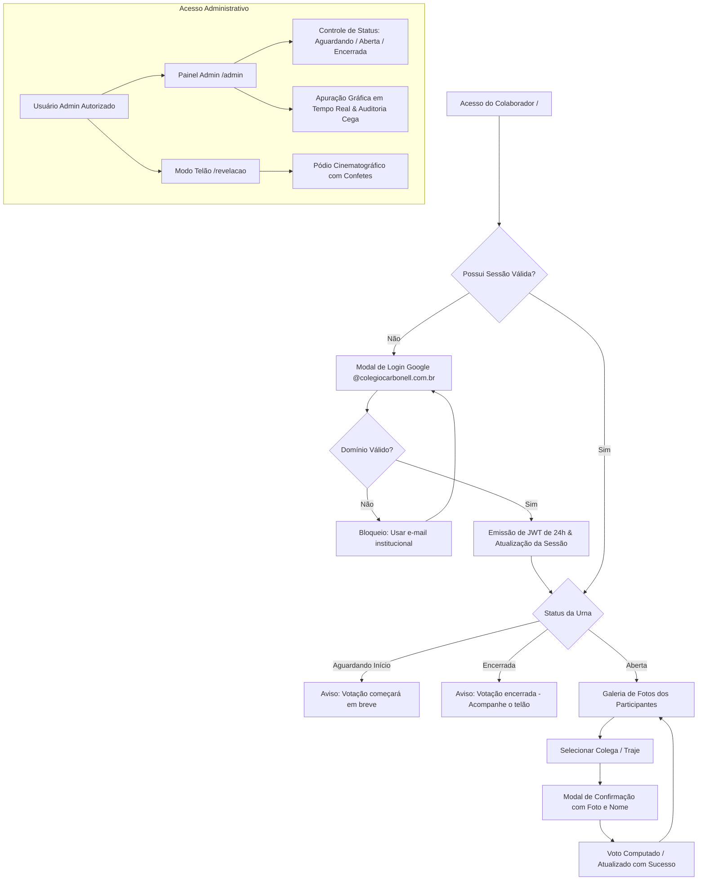

# Votação Carbonell 🎭

Aplicação web interna para administrar e operar a votação do melhor traje da Festa de Confraternização do Colégio Carbonell. Este repositório deve permanecer **privado** e é direcionado a colaboradores com acesso autorizado ao código, ao Firebase e ao projeto Google Cloud. Não transforme este repositório em público e não copie trechos com credenciais.

---

## 📌 Sumário
1. [Objetivos do Projeto](#-objetivos-do-projeto)
2. [Arquitetura & Estrutura do Projeto](#-arquitetura--estrutura-do-projeto)
3. [Tecnologias & Stack](#-tecnologias--stack)
4. [Regras de Negócio & Funcionalidades](#-regras-de-negocio--funcionalidades)
5. [Instalação e Execução Local](#-instalacao-e-execucao-local)
6. [Variáveis de Ambiente & Configurações](#-variaveis-de-ambiente--configuracoes)
7. [Guia de Deploy no Google Cloud Platform & Firebase](#-guia-de-deploy-no-google-cloud-platform--firebase)
8. [Checklist Operacional para o Dia da Festa](#-checklist-operacional-para-o-dia-da-festa)
9. [Solução de Problemas (Troubleshooting)](#-solucao-de-problemas-troubleshooting)
10. [Melhores Práticas de Desenvolvimento & Git](#-melhores-praticas-de-desenvolvimento--git)

---

> 📘 **Atenção:** A especificação técnica aprofundada, requisitos funcionais e fluxos operacionais estão disponíveis em [**`PRD_Final.md`**](PRD_Final.md), enquanto as diretrizes visuais e tokens de interface estão consolidados em [**`DESIGN_SYSTEM_PRD.md`**](DESIGN_SYSTEM_PRD.md).

---

## 🎯 Objetivos do Projeto

O objetivo principal deste projeto é fornecer uma plataforma interativa, segura, mobile-first e de alta disponibilidade para a eleição do melhor traje/fantasia na tradicional Festa de Confraternização do **Colégio Carbonell**.

O sistema elimina o problema histórico em que os colaboradores deixavam de votar ou erravam os nomes nas cédulas por não reconhecerem quem estava sob cada fantasia. Através de uma galeria com fotos de rosto nítidas e busca instantânea, cada participante reconhece seus colegas e emite seu voto com poucos toques no smartphone.

Principais pontos do sistema:
* **Reconhecimento Visual dos Colegas:** Grid responsivo com fotos em alta definição, nome, departamento e personagem do traje, com filtro de busca em tempo real.
* **Autenticação Segura Google Workspace:** Restrição estrita ao domínio institucional (`@colegiocarbonell.com.br`) via Google Identity Services (GSI OAuth 2.0), bloqueando e-mails pessoais (`@gmail.com`) ou externos.
* **Regra de Voto Único & Troca Atômica:** Cada colaborador tem direito a exatamente **1 voto ativo**. Enquanto a votação estiver aberta, o usuário pode alterar sua escolha a qualquer momento. Auto-voto é permitido.
* **Sigilo Absoluto do Voto & Auditoria Cega:** O voto é estritamente confidencial. O painel administrativo audita a presença e horário de votação dos colaboradores sem jamais associar o eleitor ao voto computado.
* **Painel da Comissão Organizadora (`/admin`):** Controle em tempo real do ciclo de vida da urna (`Aguardando Início`, `Votação Aberta` e `Votação Encerrada`), apuração gráfica instantânea e sincronização de fotos.
* **Modo Telão / Pódio Cinematográfico (`/revelacao`):** Tela em tela cheia projetada para palco e telão de LED com identidade visual Carbonell, suspense sonoro (via Web Audio API), revelação progressiva (3º, 2º e 1º lugar) e chuva de confetes virtuais.

Este README é seu guia definitivo para rodar o projeto localmente, testar regras/rotas, configurar Firebase/GCP, fazer deploy no Cloud Run e Hosting e assumir a manutenção do sistema.

---

## 🏗️ Arquitetura & Estrutura do Projeto

O projeto adota uma arquitetura desacoplada em nuvem projetada para alta concorrência e custo mínimo (FinOps):
* **Frontend (SPA):** Desenvolvido em React 19 com Vite 8 e Tailwind CSS v4, hospedado no **Firebase Hosting**. As fotos dos colaboradores são entregues diretamente pela CDN global do Hosting, reduzindo em 100% a carga de saída de dados (egress) no backend.
* **Backend (API REST):** Desenvolvido em Node.js com Express 5, encapsulado em container gerenciado no **Google Cloud Run** (`southamerica-east1`) com autoscaling automático e instância quente mínima (`--min-instances 1`).
* **Persistência de Dados (Firestore):** Os votos, catálogo e status são mantidos no **Google Cloud Firestore** (modo Nativo) utilizando transações ACID atômicas (`runTransaction`), garantindo consistência estrita sob picos de concorrência.
* **Roteamento Unificado:** O arquivo `firebase.json` unifica os domínios, servindo arquivos estáticos pela CDN e redirecionando as rotas dinâmicas `/api/**` para o Cloud Run sem atritos de CORS.

```text
votacao-confra/
├── .firebaserc                # Associação com o projeto Firebase (vota-509520)
├── firebase.json              # Configuração do Firebase Hosting e rewrites para Cloud Run
├── firestore.rules            # Regras de segurança do Cloud Firestore
├── package.json               # Scripts orquestradores (dev, build, deploy) via Concurrently
├── AGENTS.md                  # Regras de engenharia, governança SDD e padrões de Git
├── PRD_Final.md               # Especificação Oficial do Produto (Single Source of Truth)
├── DESIGN_SYSTEM_PRD.md       # Diretrizes visuais, tokens e componentes institucionais Carbonell
├── README.md                  # Este guia completo de operação e desenvolvimento
├── client/                    # Frontend SPA (React 19 + Vite 8 + Tailwind CSS v4)
│   ├── public/
│   │   ├── images/            # Logotipos institucionais (logo-fundo-branco, logo-fundo-azul, logo3)
│   │   └── photos/            # Fotos otimizadas dos colaboradores servidas pela CDN do Hosting
│   ├── src/
│   │   ├── App.jsx            # Ponto de entrada React, roteamento de abas e polling de status
│   │   ├── api.js             # Cliente HTTP com interceptor de autenticação JWT
│   │   ├── index.css          # Tokens do Tailwind CSS e estilos institucionais
│   │   ├── components/        # Componentes modulares (Navbar, CandidateCard, VoteModal, LoginModal)
│   │   └── pages/             # Telas da aplicação (VotingPage, AdminPage, RevealPage)
│   └── vite.config.js         # Configurações do Vite e proxy reverso local para o backend
└── server/                    # Backend API REST (Node.js 20 + Express 5)
    ├── index.js               # Inicialização do Express, middlewares de segurança e rate limit
    ├── db.js                  # Persistência atômica dos votos e catálogo (Firestore / Fallback)
    ├── firestore.js           # Inicialização do cliente Google Cloud Firestore
    ├── routes/
    │   ├── auth.js            # Validação do Google Identity Services (OAuth2) e sessão JWT
    │   ├── vote.js            # Endpoints de catálogo, consulta de status e registro de votos
    │   └── admin.js           # Apuração, controle do ciclo de vida, reset e sincronização de fotos
    ├── services/
    │   └── candidateSync.js   # Parser inteligente de nomes e e-mails a partir dos arquivos de foto
    ├── scripts/
    │   ├── optimizePhotos.js  # Script de compressão em lote via Sharp (redução de tamanho > 98%)
    │   └── testValidation.js  # Script de validação e testes
    ├── env.yaml               # Variáveis de ambiente injetadas no deploy do Cloud Run
    └── photos/                # Fotos originais dos colaboradores
```

### Fluxo de Navegação & Interação



---

## 🚀 Tecnologias & Stack

* **Backend:** Node.js 20+, Express 5, `@google-cloud/firestore`, `google-auth-library`, `jsonwebtoken`, `express-rate-limit`, `cors`, `dotenv`.
* **Frontend:** React 19, Vite 8, Tailwind CSS v4, `lucide-react` (iconografia 100% vetorial SVG, sem uso de emojis), `canvas-confetti`.
* **Banco de Dados & Auth:** Google Cloud Firestore (modo Nativo em `southamerica-east1`), Google Identity Services (GSI) OAuth 2.0.
* **Infraestrutura em Nuvem (GCP & Firebase):** Google Cloud Run (`votacao-backend`), Firebase Hosting, Google Cloud Console (`vota-509520`).
* **Otimização & Qualidade:** `sharp` (compressão e redimensionamento de fotos), `oxlint` (análise estática).

---

## ⚙️ Regras de Negócio & Funcionalidades

### Rotas Principais

#### Frontend (SPA)
- `/`: Galeria de fotos, busca em tempo real e emissão/troca de votos.
- `/admin`: Painel da comissão (apuração, controle de status, zerar votos e sincronização). Acesso restrito a administradores.
- `/revelacao`: Modo Telão cinematográfico em tela cheia para projeção em palco. Acesso restrito a administradores.

#### Backend (API REST)
- `GET /api/vote/candidates`: Lista pública e higienizada de todos os participantes cadastrados.
- `GET /api/vote/status`: Consulta leve do ciclo de vida da urna (`waiting`, `open`, `closed`) e voto do usuário logado.
- `POST /api/vote`: Registro ou alteração atômica do voto. Limitado por e-mail do colaborador autenticado.
- `POST /api/auth/google`: Validação criptográfica do ID Token Google e emissão do JWT de sessão (validade de 24 horas).
- `GET /api/admin/metrics`: Apuração privada dos votos, ranking decrescente, contagem e auditoria de presença.
- `POST /api/admin/status`: Alternância manual do status da votação com loading state visual nos botões.
- `POST /api/admin/reset`: Limpeza emergencial de votos mediante envio de frase de confirmação (`ZERAR_VOTOS_CONFIRMAR`).
- `POST /api/admin/sync-photos`: Varredura da pasta de fotos e atualização do catálogo no Firestore.

### Coleções no Firestore
- `config`: Documento `app` contendo o status da votação (`waiting`, `open`, `closed`), título da eleição e administradores autorizados.
- `candidates`: Catálogo de colaboradores participantes (`id`, `name`, `email`, `department`, `costumeName`, `photoUrl`).
- `votes`: Votos secretos computados com totalizadores agregados por candidato.
- `voters`: Registro seguro de participação (`voterEmail`, `voterName`, `timestamp`) para auditoria de presença, sem jamais expor o voto emitido.

### Regras de Votação
- **Voto Único:** Cada colaborador autenticado tem direito a exatamente 1 voto ativo.
- **Alteração Permitida:** Enquanto a urna estiver com status `open`, o colaborador pode alterar seu voto para outro participante a qualquer momento.
- **Auto-voto Permitido:** O colaborador cadastrado pode votar em si mesmo caso deseje.
- **Confirmação Explícita:** Toda intenção de voto abre um modal destacando foto e nome do participante para prevenir toques acidentais.
- **Feedback Visual:** O participante votado recebe borda e etiqueta destacada em tom amarelo/ouro Carbonell (`#f7b53b`) com a mensagem `"Seu Voto Atual"`.

### Matriz de Perfis (RBAC Estrito)
- **Colaborador Comum:** Acesso exclusivo à galeria de votação (`/`). Não visualiza e não tem acesso às abas de Admin e Telão. Tentativas de chamada em endpoints administrativos retornam HTTP 403 Forbidden.
- **Administrador (Comissão da Festa):** E-mails pré-definidos (`thiago.luiz@colegiocarbonell.com.br`, `patricia.santos@colegiocarbonell.com.br`, `marina.ribeiro@colegiocarbonell.com.br`, `raquel.favatto@colegiocarbonell.com.br`, `caroline.costa@colegiocarbonell.com.br`) possuem flag `isAdmin: true` e acesso total aos recursos do sistema.

---

## 💻 Instalação e Execução Local

### Requisitos
- Windows com PowerShell
- Node.js v20 ou superior instalado
- Git instalado
- (Opcional para testes com o Firestore real) Google Cloud SDK configurado: `gcloud auth application-default login`

### Como rodar
1. **Clone e entre na pasta do projeto:**
   ```powershell
   cd C:\Users\thiago.luiz\Desktop\Desenvolvimento\votacao-confra
   ```
2. **Instalação das dependências (raiz, servidor e cliente):**
   ```powershell
   npm install
   npm --prefix server install
   npm --prefix client install
   ```
3. **Variáveis de Ambiente:**
   ```powershell
   Copy-Item server\.env.example server\.env
   ```
   *Ajuste o `server/.env` caso queira apontar para o projeto GCP ou utilizar segredos customizados.*
4. **Suba a aplicação:**
   ```powershell
   npm run dev
   ```
   Este comando executa simultaneamente o backend e o frontend através do `concurrently`:
   * **Página de Votação (Frontend):** `http://localhost:5173`
   * **Painel Administrativo:** `http://localhost:5173/admin`
   * **Modo Telão:** `http://localhost:5173/revelacao`
   * **API Backend:** `http://localhost:3001/api/health`

### Opções de Autenticação Local
* **Modo Desenvolvimento (Mock Rápido):**
  Ao rodar localmente (`import.meta.env.DEV`), o modal de login exibe uma barra de seleção rápida com colaboradores de teste e contas de administrador. Não é necessário autenticar com uma conta Google real para validar fluxos, telas e apurações.
* **Modo Produção / Google Real:**
  Configurando a variável `GOOGLE_CLIENT_ID` no `server/.env`, o modal renderiza o botão oficial do Google Identity Services (GSI), validando a assinatura de token no backend com restrição ao domínio `@colegiocarbonell.com.br`.

### Como Cadastrar e Otimizar Fotos dos Colaboradores
As fotos de rosto dos colaboradores devem ser inseridas no diretório:
`server/photos/`

#### Padrões de nomes de arquivo suportados:
1. **Padrão Oficial Recomendado:** `Nome Completo - email@colegiocarbonell.com.br.jpg`  
   *Exemplo:* `Mariana Santos - mariana.santos@colegiocarbonell.com.br.jpg`
2. **Pelo E-mail:** `email@colegiocarbonell.com.br.jpg`  
   *Exemplo:* `carlos.ramos@colegiocarbonell.com.br.jpg` (o sistema formata para Carlos Ramos)
3. **Pelo Nome:** `Nome Sobrenome.jpg`  
   *Exemplo:* `Beatriz Almeida.jpg` (o sistema gera o e-mail institucional correspondente)

#### Processamento e Sincronização:
1. Comprima as fotos originais executando o script de otimização via Sharp:
   ```powershell
   cd server
   npm run optimize-photos
   cd ..
   ```
   *O script redimensiona as fotos para resolução máxima de 500px e formato otimizado, reduzindo o catálogo de ~180MB para ~2.8MB (mais de 98% de economia de dados).*
2. Copie as fotos otimizadas para `client/public/photos/` para que sejam servidas pela CDN do Hosting.
3. Acesse o painel **Admin** (`/admin`) e clique no botão **"Sincronizar Fotos"**.

---

## 🔐 Variáveis de Ambiente & Configurações

**Nunca versione `.env`, `.env.*` ou credenciais privadas no Git.**  
Em produção (`NODE_ENV=production`), atalhos de desenvolvimento e endpoints de bypass de login são completamente desativados (HTTP 403 Forbidden).

### Variáveis do Backend (`server/.env`)
| Variável | Descrição | Exemplo |
| :--- | :--- | :--- |
| `PORT` | Porta de escuta do servidor Express local | `3001` |
| `NODE_ENV` | Modo de execução (`development` ou `production`) | `production` |
| `JWT_SECRET` | Chave criptográfica usada na assinatura dos tokens de sessão (24h) | `string-longa-e-segura` |
| `GOOGLE_CLIENT_ID` | Client ID Web do Google Identity Services | `250885127015-...apps.googleusercontent.com` |
| `GOOGLE_CLOUD_PROJECT` | ID do projeto no Google Cloud | `vota-509520` |
| `FIRESTORE_DATABASE_ID` | Identificador do banco Firestore | `(default)` |
| `ADMIN_EMAILS` | Lista de e-mails de administradores separados por vírgula | `thiago.luiz@colegiocarbonell.com.br,...` |

### Arquivo de Produção do Cloud Run (`server/env.yaml`)
No deploy gerenciado do Cloud Run, as variáveis são injetadas de forma declarativa e segura através do arquivo `server/env.yaml`.

---

## ☁️ Guia de Deploy no Google Cloud Platform & Firebase

**Projeto Oficial:** `vota-509520` | **Região:** `southamerica-east1` (São Paulo)

O projeto possui comandos integrados no `package.json` para facilitar o processo de deploy:

### 1. Deploy Unificado (Recomendado)
Executa o build de produção do frontend, realiza o deploy da API no Cloud Run e publica os arquivos estáticos no Firebase Hosting:
```powershell
npm run deploy
```

### 2. Deploy Isolado por Serviço

* **Apenas o Backend no Cloud Run (`votacao-backend`):**
  ```powershell
  npm run deploy:server
  ```
  *Executa o provisionamento gerenciado com `--min-instances 1`, `--max-instances 10`, memória alocada de 512Mi e injeção do `server/env.yaml`.*

* **Apenas o Frontend no Firebase Hosting:**
  ```powershell
  npm run deploy:client
  ```
  *Gera o build estático em `client/dist` e publica na CDN global do Firebase.*

### 3. Validação pós-deploy
Acesse a rota de verificação para garantir que o serviço está ativo e conectado ao Firestore:
`https://vota-509520.web.app/api/health`

---

## 📋 Checklist Operacional para o Dia da Festa

Para garantir estabilidade total e zero imprevistos durante a confraternização, a comissão organizadora deve seguir este roteiro:

### Antes da Festa Começar:
1. **Zerar a Urna e Definir Status Inicial:**
   - Acesse o painel administrativo em `https://vota-509520.web.app/admin` com uma das contas autorizadas.
   - Na seção "Zerar Todos os Votos", digite a frase de segurança `ZERAR_VOTOS_CONFIRMAR` para limpar quaisquer registros de testes.
   - Clique no botão **"Aguardando Início"** para que nenhum colaborador vote antes da abertura oficial.
2. **Conferência do Catálogo de Participantes:**
   - Verifique se todos os colaboradores presentes estão listados na galeria com fotos nítidas e setores corretos.
   - Caso precise cadastrar alguém de última hora, adicione a foto e utilize o botão "Sincronizar Fotos" do Admin.
3. **QR Code e Instruções nas Mesas:**
   - Certifique-se de que os displays de mesa apontam para: `https://vota-509520.web.app`.
   - Recomende o uso exclusivo da conta institucional Google (`@colegiocarbonell.com.br`).
4. **Preparação do Telão no Palco:**
   - Conecte o computador ao projetor ou telão de LED via HDMI.
   - Faça login com uma conta de administrador e abra a tela do **Modo Telão** (`/revelacao`).
   - Clique no botão de **Tela Cheia** (`Maximize`) para ocultar barras do navegador.
   - Realize um teste prévio de áudio com a mesa de som da festa (os efeitos sonoros utilizam a Web Audio API nativa do navegador).

### Durante a Votação:
1. **Abertura da Urna:**
   - Quando o cerimonial anunciar no microfone o início da votação, clique em **"Abrir Votação"** no painel administrativo.
   - Acompanhe a taxa de participação e o gráfico de apuração ao vivo. A arquitetura com polling leve e CDN suporta centenas de celulares simultâneos na mesma rede Wi-Fi sem erro 429.
2. **Encerramento da Urna:**
   - Dê o aviso de "último minuto" e clique em **"Encerrar Votação"**. A partir desse momento novos votos e alterações ficam bloqueados.

### Momento da Premiação (Palco):
- Alterne para a tela do **Modo Telão** (`/revelacao`):
  1. Clique em **Revelar 3º Lugar** (suspense sonoro e revelação do 3º colocado).
  2. Clique em **Revelar 2º Lugar** (suspense sonoro e revelação do 2º colocado).
  3. Clique em **Revelar o Grande Campeão** (fanfarra sonora e chuva de confetes virtuais em tela cheia).

---

## 🔧 Solução de Problemas (Troubleshooting)

* **Dispositivos na mesma rede Wi-Fi recebem erro HTTP 429:**
  O Express está configurado com `trust proxy` ativado. A rota de polling de status (`GET /api/vote/status`) e as rotas de health check são isentas de rate limit por IP, e a submissão de voto (`POST /api/vote`) é limitada estritamente pelo e-mail do colaborador autenticado (`req.user.email`), garantindo equidade sem penalizar a rede local coletiva.
* **Login Google falha ou informa "Origem não permitida" (Origin Mismatch):**
  Acesse o Google Cloud Console em "APIs & Services > Credentials", edite o OAuth 2.0 Web Client e certifique-se de que `https://vota-509520.web.app` e `https://vota-509520.firebaseapp.com` estejam cadastrados em "Authorized JavaScript origins".
* **Lentidão ao carregar a galeria de fotos:**
  As fotos devem estar otimizadas e presentes em `client/public/photos/`. Caso o carregamento esteja pesado, execute `npm run optimize-photos` na pasta `server` e faça o deploy do cliente (`npm run deploy:client`) para que as fotos sejam entregues pela CDN do Hosting.
* **Demora na primeira requisição (Cold Start no Cloud Run):**
  Para a noite do evento, o Cloud Run deve estar configurado com `--min-instances 1` (já definido no script `deploy:server`), mantendo ao menos uma instância aquecida e pronta para atender requisições instantaneamente.
* **Sessão do usuário expirada durante a festa:**
  O token JWT possui validade de 24 horas para cobrir com segurança toda a confraternização. Caso ocorra erro HTTP 401 por expiração, a aplicação executa auto-recovery transparente, limpando a sessão e orientando o usuário a reautenticar com um único toque.

---

## 🛡️ Melhores Práticas de Desenvolvimento & Git

### Segurança
- Este repositório é estritamente **privado**.
- Nenhuma credencial, segredo de JWT ou chave privada deve ser commitada no Git.
- O acesso ao Cloud Firestore é restrito à Service Account do Cloud Run (`roles/datastore.user`), mantendo regras de segurança bloqueadas para clientes externos no `firestore.rules`.

### Padrões de Git & Governança (conforme `AGENTS.md`)
1. **Identificação do Agente nas Branches:**
   - Alterações vinculadas a uma spec: `<agente>-<numero-da-spec>/<prefixo>-<descricao>` (ex.: `antigravity-001/feat-identidade-visual`).
   - Alterações sem spec: `<agente>/<prefixo>-<descricao>` (ex.: `antigravity/docs-atualizacao-readme`).
2. **Padrão de Commits:**
   - Título no formato Conventional Commits: `<prefixo_em_ingles>: <descrição em pt-BR>` (ex.: `docs: atualizar documentacao do projeto no padrao institucional`).
   - Descrição detalhada no corpo (body) formatada em Markdown explicando o **contexto**, **o que foi feito** e **o porquê foi feito**.
3. **Padrão Spec-Driven Development (SDD):**
   - Os arquivos [**`PRD_Final.md`**](PRD_Final.md) e [**`DESIGN_SYSTEM_PRD.md`**](DESIGN_SYSTEM_PRD.md) são a **Única Fonte da Verdade (Single Source of Truth)**. Qualquer nova funcionalidade ou regra deve ser registrada nos PRDs antes de ser codificada.
