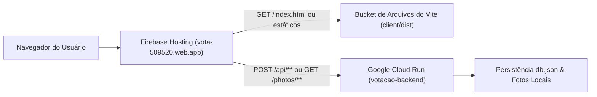

# Modelo de Configuração e Infraestrutura: Spec 002

**Feature**: Deploy em Produção (Firebase Hosting + Google Cloud Run) e Google OAuth  
**Status**: Aprovado  

---

## 1. Variáveis de Ambiente e Configuração

### 1.1 Backend (Google Cloud Run)

| Variável | Tipo | Obrigatório em Produção | Descrição | Exemplo |
| :--- | :---: | :---: | :--- | :--- |
| `PORT` | Number | Sim (Injetado pelo Cloud Run) | Porta onde o Express escuta | `8080` |
| `NODE_ENV` | String | Sim | Ambiente de execução | `production` |
| `JWT_SECRET` | String | Sim | Chave de assinatura dos tokens de sessão | `carbonell-festa-2026-prod-jwt-secret` |
| `GOOGLE_CLIENT_ID` | String | Sim | Client ID OAuth 2.0 Web do Google Cloud | `250885127015-xxx.apps.googleusercontent.com` |
| `ADMIN_EMAILS` | String | Sim | Lista de e-mails de administradores separados por vírgula | `ti@colegiocarbonell.com.br,diretoria@colegiocarbonell.com.br` |

### 1.2 Frontend (Firebase Hosting / Client Build)

| Variável | Tipo | Obrigatório | Descrição | Exemplo |
| :--- | :---: | :---: | :--- | :--- |
| `VITE_GOOGLE_CLIENT_ID` | String | Não (Opcional) | Client ID exibido no botão Google GSI | `250885127015-xxx.apps.googleusercontent.com` |
| `VITE_API_URL` | String | Não | URL base da API (em branco usa caminho relativo `/api` do Firebase Rewrite) | `""` |

---

## 2. Estrutura de Arquivos de Infraestrutura

```text
votacao-confra/
├── .firebaserc                     # Alias do projeto vota-509520
├── firebase.json                   # Regras de Hosting e Rewrites para Cloud Run
├── server/
│   ├── Dockerfile                  # Container Node.js 20 Alpine para Cloud Run
│   ├── .dockerignore               # Ignora node_modules locais e logs
│   ├── index.js                    # Ajustado para process.env.PORT e 0.0.0.0
│   └── ...
└── client/
    ├── dist/                       # Artefato gerado pelo build do Vite
    └── ...
```

---

## 3. Modelo do Dockerfile do Backend

```dockerfile
FROM node:20-alpine AS runner

WORKDIR /app

ENV NODE_ENV=production
ENV PORT=8080

COPY package*.json ./
RUN npm ci --only=production

COPY . .

EXPOSE 8080

CMD ["node", "index.js"]
```

---

## 4. Contrato de Roteamento Unificado (Gateway)


