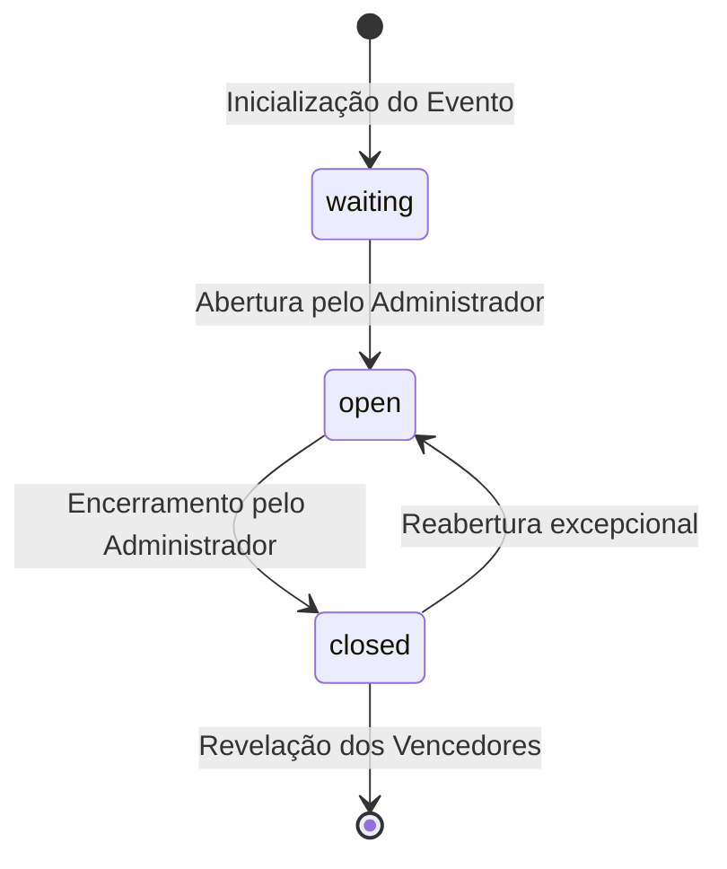

# Modelo de Dados: Persistência em Nuvem (Google Cloud Firestore)

**Feature**: `003-estabilizacao-nuvem-seguranca`  
**Branch**: `antigravity-003/feat-estabilizacao-nuvem-seguranca`  
**Data**: 2026-09-24  

---

## 1. Estrutura de Coleções no Firestore

```text
Firestore Root (Projeto: vota-509520)
├── config/
│   └── app_state               # Configurações globais e status da votação
├── candidates/
│   └── {candidateId}           # Catálogo de colaboradores participantes
└── votes/
    └── {voterEmailHash}        # Voto emitido e auditável com sigilo garantido
```

---

## 2. Documentos e Esquemas

### 2.1 Coleção `config` (Documento `app_state`)
Representa o ciclo de vida e parametrizações operacionais da eleição.

| Campo | Tipo | Descrição | Regras de Validação |
| :--- | :--- | :--- | :--- |
| `status` | `string` | Status atual da urna: `'waiting'`, `'open'` ou `'closed'` | Obrigatório. Valor padrão: `'open'` |
| `title` | `string` | Título oficial da votação | Padrão: `"Festa de Confraternização - Melhor Fantasia"` |
| `allowVoteChange` | `boolean` | Se o colaborador pode alterar seu voto enquanto estiver aberto | Padrão: `true` |
| `adminEmails` | `array<string>` | Lista de e-mails institucionais autorizados como administradores | Normalizados em minúsculas |
| `updatedAt` | `timestamp` | Carimbo de data/hora da última alteração de status | Atualizado a cada mudança |

---

### 2.2 Coleção `candidates` (Documento `{candidateId}`)
Representa o colaborador elegível para votação.

| Campo | Tipo | Descrição | Regras de Validação |
| :--- | :--- | :--- | :--- |
| `id` | `string` | Identificador determinístico (`c_` + hash MD5 do e-mail, 12 chars) | Chave primária única |
| `name` | `string` | Nome completo do colaborador | Não vazio |
| `email` | `string` | E-mail institucional `@colegiocarbonell.com.br` | Único, minúsculo |
| `photoUrl` | `string` | Caminho relativo da foto otimizada (ex: `/photos/Nome.jpg`) | URL válida |
| `department` | `string` | Departamento ou setor na escola | Padrão: `"Colégio Carbonell"` |
| `costumeName` | `string` | Nome da fantasia ou personagem | Opcional |

---

### 2.3 Coleção `votes` (Documento `{voterEmailHash}`)
Registra o voto único de cada colaborador com chave baseada em hash SHA-256 do e-mail institucional.

| Campo | Tipo | Descrição | Regras de Validação |
| :--- | :--- | :--- | :--- |
| `candidateId` | `string` | Identificador do candidato escolhido | Deve existir na coleção `candidates` |
| `voterEmail` | `string` | E-mail do eleitor | Utilizado para integridade de voto único |
| `voterName` | `string` | Nome institucional do colaborador | Usado apenas para presença anônima |
| `timestamp` | `timestamp` | Data e hora em que o voto foi emitido ou alterado | Gerado via `FieldValue.serverTimestamp()` |

> **Garantia de Sigilo do Voto na Apuração**:
> A API de métricas administrativas (`/api/admin/metrics`) calcula o somatório agrupando por `candidateId` e projeta a lista de presença contendo apenas `{ voterName, voterEmail, timestamp }`, sem expor o campo `candidateId` associado ao nome do colaborador.

---

## 3. Transições de Estado da Urna



- **waiting**: Votos são rejeitados com código 400 (`"A votação ainda não foi aberta"`).
- **open**: Votos e alterações são processados e validados atomicamente.
- **closed**: Votos e alterações são rejeitados com código 400 (`"A votação foi encerrada"`).
