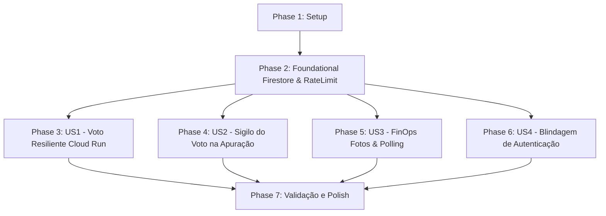

# Tasks: Estabilização de Nuvem, FinOps e Segurança (003)

**Input**: Documentos de design em `/specs/003-estabilizacao-nuvem-seguranca/`  
**Prerequisites**: [plan.md](./plan.md), [spec.md](./spec.md), [research.md](./research.md), [data-model.md](./data-model.md), [contracts/api-contracts.md](./contracts/api-contracts.md)  
**Organization**: Tarefas atomizadas agrupadas por fase e histórias de usuário (US1 a US4).

---

## Formato: `- [ ] [ID] [P?] [Story?] Descrição com caminho de arquivo`

- **[P]**: Tarefa paralelizada (arquivos distintos, sem dependência bloqueante).
- **[Story]**: Mapeamento para a História de Usuário correspondente ([US1], [US2], [US3], [US4]).
- Todos os itens possuem caminhos absolutos/relativos exatos dos arquivos afetados.

---

## Phase 1: Setup (Infraestrutura e Dependências)

**Propósito**: Inicialização de bibliotecas de nuvem, FinOps e variáveis do projeto.

- [x] T001 Instalar dependências `@google-cloud/firestore`, `express-rate-limit` e `sharp` em `server/package.json`
- [x] T002 [P] Atualizar arquivo de variáveis de ambiente com documentação de produção em `server/.env.example`

---

## Phase 2: Foundational (Pré-Requisitos Bloqueantes)

**Propósito**: Infraestrutura central de dados e proteção de rede compartilhada por todas as histórias de usuário.

**⚠️ CRITICAL**: Nenhuma história de usuário deve ser iniciada antes da conclusão desta fundação.

- [x] T003 Criar módulo de conexão com Google Cloud Firestore com suporte a ADC em `server/firestore.js`
- [x] T004 Atualizar camada de persistência com métodos assíncronos e transações em `server/db.js`
- [x] T005 [P] Configurar middleware de limitação de taxa (rate limiting) defensivo em `server/index.js`

**Checkpoint**: Camada de banco de dados e proteção de tráfego inicializada e validada.

---

## Phase 3: User Story 1 - Voto Resiliente e Concorrente em Nuvem (Priority: P1) 🎯 MVP

**Meta**: Eliminar o risco de perda de votos no Cloud Run persistindo votos e status atomicamente no Firestore.  
**Teste Independente**: Submeter múltiplos votos simultâneos e verificar que a persistência permanece 100% íntegra após reciclagem do container.

- [x] T006 [US1] Implementar registro e alteração atômica de votos via `firestore.runTransaction` em `server/routes/vote.js`
- [x] T007 [P] [US1] Migrar consulta de status da eleição e voto do usuário logado para o Firestore em `server/routes/vote.js`
- [x] T008 [US1] Implementar sincronização inicial de catálogo de candidatos no Firestore durante startup em `server/services/candidateSync.js`

**Checkpoint**: A votação é 100% tolerante a falhas e opera de forma persistente no Cloud Run.

---

## Phase 4: User Story 2 - Sigilo Estrito do Voto na Apuração (Priority: P1)

**Meta**: Blindar a privacidade do colaborador na administração, mantendo apenas a lista de presença sem exibir o candidato votado.  
**Teste Independente**: Acessar o endpoint `/api/admin/metrics` e a tela `/admin` confirmando que os votos são agregados e o log de presença é anônimo.

- [x] T009 [US2] Refatorar endpoint de apuração em `server/routes/admin.js` para calcular ranking consolidado e emitir `auditAttendance` sem associação de candidato
- [x] T010 [P] [US2] Atualizar seção de auditoria no frontend em `client/src/pages/AdminPage.jsx` para exibir lista de presença (nome, e-mail e horário) com sigilo de voto

**Checkpoint**: O painel administrativo preserva o sigilo constitucional do voto do colaborador.

---

## Phase 5: User Story 3 - Carregamento Leve e Rápido em Redes Móveis (FinOps) (Priority: P2)

**Meta**: Reduzir em mais de 90% o peso das fotos e o volume de requisições de candidatos no Cloud Run.  
**Teste Independente**: Medir o tamanho da pasta de fotos (< 7 MB) e verificar no Network tab do navegador que a lista de candidatos é requisitada uma única vez.

- [x] T011 [US3] Criar script utilitário de compressão e redimensionamento em lote (máx 500px, WebP/JPEG ~50KB) em `server/scripts/optimizePhotos.js`
- [x] T012 [US3] Executar otimização em lote reduzindo as 161 fotos em `server/photos/` de 187 MB para menos de 7 MB
- [x] T013 [P] [US3] Configurar cabeçalhos de cache estático com CDN (`max-age=604800, immutable`) em `server/index.js`
- [x] T014 [US3] Desacoplar polling no React em `client/src/App.jsx`, buscando `fetchCandidates()` uma única vez e checando `/api/vote/status` a cada 12 segundos

**Checkpoint**: O consumo de dados móveis cai de 187 MB para < 7 MB e o polling repetitivo é eliminado.

---

## Phase 6: User Story 4 - Blindagem de Autenticação em Ambiente de Produção (Priority: P2)

**Meta**: Impedir qualquer atalho de login não autenticado em produção e forçar validação de ID Token do Google Workspace.  
**Teste Independente**: Disparar POST contra `/api/auth/dev-login` com `NODE_ENV=production` e validar bloqueio HTTP 403.

- [x] T015 [US4] Adicionar trava restrita em `server/routes/auth.js` bloqueando `/api/auth/dev-login` quando `NODE_ENV === 'production'`
- [x] T016 [P] [US4] Tornar mandatória a verificação criptográfica do Google ID Token via `OAuth2Client` em `server/routes/auth.js`
- [x] T017 [US4] Ocultar perfis de demonstração rápida e atalho de dev-login em `client/src/components/LoginModal.jsx` em build de produção

**Checkpoint**: Autenticação blindada sem rotas de bypass abertas em ambiente de nuvem.

---

## Phase 7: Polish & Cross-Cutting Concerns

**Propósito**: Validações finais, testes integrados e documentação do projeto.

- [x] T018 [P] Atualizar documentação e manual de operação no `README.md`
- [x] T019 Executar bateria completa de validação de ponta a ponta conforme `specs/003-estabilizacao-nuvem-seguranca/quickstart.md`

---

## Dependências & Ordem de Execução

### Oportunidades de Paralelismo
- Tarefas **T002**, **T005**, **T007**, **T010**, **T013**, **T016** e **T018** podem ser desenvolvidas em paralelo pois afetam arquivos independentes.
- As fases de **FinOps (Phase 5)** e **Segurança (Phase 6)** podem ser executadas concomitantemente após a conclusão da Phase 2.
