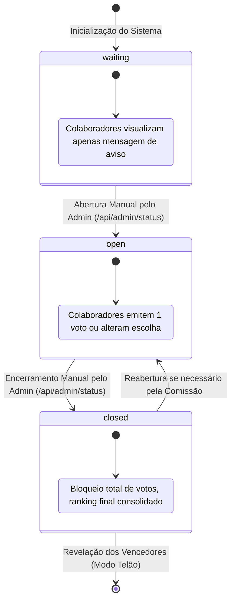

# Data Model & State Architecture: Correções de Auditoria e FinOps

**Feature**: `004-correcoes-auditoria-finops`  
**Date**: 2026-09-25  
**Database**: Google Cloud Firestore (Modo Nativo)

---

## 1. Entidades do Firestore

### 1.1 Coleção `config` (Documento `app_state`)
Armazena a configuração global e o ciclo de vida da urna.

```typescript
interface AppStateDocument {
  status: 'waiting' | 'open' | 'closed';  // Estado do ciclo de vida da votação
  title: string;                          // Título do evento
  allowVoteChange: boolean;               // Permissão para trocar de voto
  adminEmails: string[];                  // Lista de e-mails autorizados para administração
}
```

* **Regras de Validação:**
  - `status` aceita exclusivamente `'waiting'`, `'open'` ou `'closed'`.
  - Apenas administradores autenticados podem alterar campos deste documento.

---

### 1.2 Coleção `candidates` (Documentos com ID `c_<hash>`)
Catálogo de participantes e fantasias cadastrados para a festa.

```typescript
interface CandidateDocument {
  id: string;                             // Identificador único (ex: c_a1b2c3d4e5f6)
  name: string;                           // Nome formatado do colaborador
  email: string;                          // E-mail institucional (@colegiocarbonell.com.br)
  photoUrl: string;                       // Caminho público da foto (/photos/...)
  department: string;                     // Departamento ou 'Colégio Carbonell'
  costumeName: string;                    // Nome ou descrição da fantasia
}
```

* **Regras de Validação:**
  - `email` deve terminar estritamente com `@colegiocarbonell.com.br`.
  - `name` é obrigatório e sem caracteres de escape inválidos.
  - `photoUrl` aponta para a entrega direta da CDN do Firebase Hosting.

---

### 1.3 Coleção `votes` (Documentos com ID `<voterEmail>`)
Registros de votos individuais garantindo o princípio de 1 voto por colaborador.

```typescript
interface VoteDocument {
  candidateId: string;                    // ID do candidato escolhido
  voterEmail: string;                     // E-mail institucional do eleitor
  voterName: string;                      // Nome do eleitor no momento do voto
  timestamp: FirebaseFirestore.Timestamp; // Carimbo de data/hora oficial do servidor
}
```

* **Regras de Integridade e Sigilo:**
  - O ID do documento é o próprio e-mail normalizado (`email.toLowerCase().trim()`), garantindo unicidade no banco de dados.
  - A operação de voto ocorre dentro de uma **transação atômica** (`db.runTransaction`), impedindo que alterações concorrentes gerem votos duplicados.
  - No endpoint de apuração (`/api/admin/metrics`), o vínculo nominal entre `candidateId` e `voterEmail` é desacoplado, expondo apenas a lista anônima de presença para auditoria.

---

## 2. Modelos em Memória (Runtime Backend)

### 2.1 Cache em Memória de Candidatos (`CandidateCache`)
Mantido no runtime Node.js do Cloud Run para conservação de quotas do Firestore.

```typescript
interface CandidateCache {
  data: CandidateDocument[] | null;
  expiresAt: number;                      // Timestamp Unix em milissegundos
}
```

* **Estratégia de Cache:**
  - **TTL (Time-to-Live):** 10 minutos (600.000 ms).
  - **Invalidação Reativa:** Forçada a cada chamada bem-sucedida de `syncCandidatesFromPhotosDir()` ou `addCandidate()`.
  - **Fallback:** Se o cache expirar ou estiver vazio, executa uma leitura única ordenada da coleção `candidates` e armazena novamente.

---

### 2.2 Sessão de Usuário Autenticado (`UserSession`)
Conteúdo assinado criptograficamente no token JWT emitido após login Google.

```typescript
interface UserSession {
  email: string;                          // E-mail institucional validado
  name: string;                           // Nome de exibição retornado pelo Google
  picture: string;                        // Avatar retornado pelo Google
  isAdmin: boolean;                       // Flag calculada com base na lista de administradores
  exp: number;                            // Expiração Unix do token JWT (4 horas)
}
```

---

## 3. Máquina de Estados da Votação


