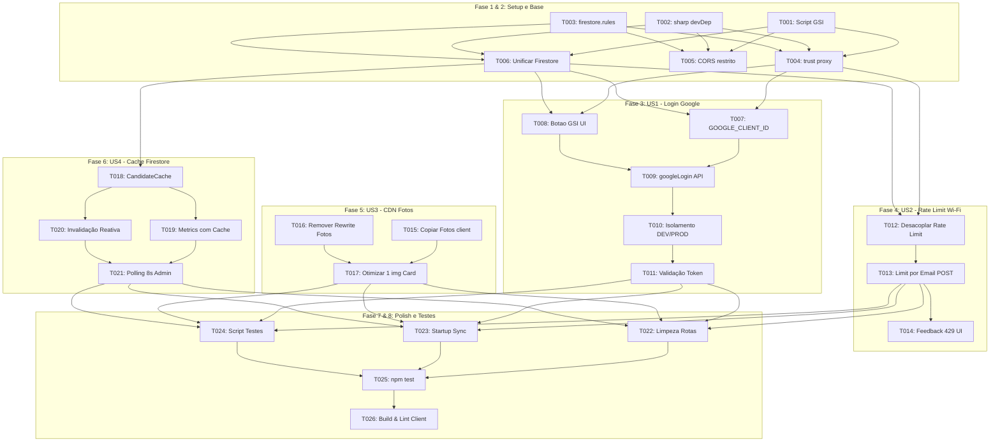

# Tasks: Correções de Auditoria, Hardening de Autenticação e Otimização FinOps

**Input**: Documentos de design em `/specs/004-correcoes-auditoria-finops/`  
**Prerequisites**: [plan.md](file:///c:/Users/thiago.luiz/Desktop/Desenvolvimento/votacao-confra/specs/004-correcoes-auditoria-finops/plan.md), [spec.md](file:///c:/Users/thiago.luiz/Desktop/Desenvolvimento/votacao-confra/specs/004-correcoes-auditoria-finops/spec.md), [research.md](file:///c:/Users/thiago.luiz/Desktop/Desenvolvimento/votacao-confra/specs/004-correcoes-auditoria-finops/research.md), [data-model.md](file:///c:/Users/thiago.luiz/Desktop/Desenvolvimento/votacao-confra/specs/004-correcoes-auditoria-finops/data-model.md), [contracts/api-contracts.md](file:///c:/Users/thiago.luiz/Desktop/Desenvolvimento/votacao-confra/specs/004-correcoes-auditoria-finops/contracts/api-contracts.md)

---

## Format: `[ID] [P?] [Story] Description`
* **[P]**: Tarefa executável em paralelo (arquivos isolados e sem dependência mútua direta).
* **[US#]**: História de usuário à qual a tarefa pertence (US1 a US5).
* Caminhos de arquivos explícitos e critérios de aceite objetivos em cada item.

---

## Phase 1: Setup & Estrutura Base

**Objetivo**: Preparação de dependências, SDKs externos e políticas de segurança fundamentais.

- [x] T001 [P] Injetar o script oficial do Google Identity Services (`https://accounts.google.com/gsi/client`) com atributos `async defer` no arquivo [client/index.html](file:///c:/Users/thiago.luiz/Desktop/Desenvolvimento/votacao-confra/client/index.html).
- [x] T002 [P] Mover a dependência `sharp` da seção `dependencies` para `devDependencies` no arquivo [server/package.json](file:///c:/Users/thiago.luiz/Desktop/Desenvolvimento/votacao-confra/server/package.json) para reduzir o tamanho da imagem Docker e o cold start do Cloud Run.
- [x] T003 [P] Criar o arquivo de regras de segurança [firestore.rules](file:///c:/Users/thiago.luiz/Desktop/Desenvolvimento/votacao-confra/firestore.rules) na raiz do projeto bloqueando 100% de leitura e gravação direta de clientes externos (`allow read, write: if false;`).

---

## Phase 2: Foundational (Infraestrutura Crítica Bloqueante)

**Objetivo**: Configurações de proxy reverso, persistência no Firestore e CORS que sustentam todas as histórias de usuário.

- [x] T004 Configurar `app.set('trust proxy', 1)` no arquivo [server/index.js](file:///c:/Users/thiago.luiz/Desktop/Desenvolvimento/votacao-confra/server/index.js) para resolução precisa do IP dos clientes através do Cloud Run e Firebase Hosting.
- [x] T005 [P] Restringir as origens do CORS no arquivo [server/index.js](file:///c:/Users/thiago.luiz/Desktop/Desenvolvimento/votacao-confra/server/index.js) aos domínios autorizados do Firebase Hosting (`https://vota-509520.web.app`, `https://vota-509520.firebaseapp.com`) e `localhost` em desenvolvimento.
- [x] T006 Unificar as funções de acesso a dados em [server/db.js](file:///c:/Users/thiago.luiz/Desktop/Desenvolvimento/votacao-confra/server/db.js) para operar exclusivamente no Firestore, removendo a escrita síncrona duplicada em arquivos locais `db.json` e `.tmp`.

**Checkpoint**: Base de proxy, Firestore e segurança pronta para receber as histórias de usuário.

---

## Phase 3: User Story 1 - Autenticação Google Institucional & Desbloqueio em Produção (Priority: P1) 🎯 MVP

**Objetivo**: Permitir que 100% dos colaboradores com conta `@colegiocarbonell.com.br` façam login oficial via Google Sign-In (GSI), eliminando o erro HTTP 403 em produção e mantendo atalhos rápidos restritos a `localhost`.

- [x] T007 [US1] Configurar a variável `GOOGLE_CLIENT_ID` nos arquivos [server/.env.example](file:///c:/Users/thiago.luiz/Desktop/Desenvolvimento/votacao-confra/server/.env.example), [server/env.yaml](file:///c:/Users/thiago.luiz/Desktop/Desenvolvimento/votacao-confra/server/env.yaml) e [client/.env.production](file:///c:/Users/thiago.luiz/Desktop/Desenvolvimento/votacao-confra/client/.env.production).
- [x] T008 [US1] Implementar a inicialização e renderização do botão oficial Google Sign-In no componente [client/src/components/LoginModal.jsx](file:///c:/Users/thiago.luiz/Desktop/Desenvolvimento/votacao-confra/client/src/components/LoginModal.jsx) via `window.google.accounts.id`, com restrição de domínio `hd: 'colegiocarbonell.com.br'`.
- [x] T009 [US1] Conectar a resposta do Google Sign-In à função `googleLogin(credential)` no [client/src/components/LoginModal.jsx](file:///c:/Users/thiago.luiz/Desktop/Desenvolvimento/votacao-confra/client/src/components/LoginModal.jsx), disparando a emissão da sessão e fechamento do modal.
- [x] T010 [US1] Condicionar a visibilidade do formulário manual de login e atalhos de demonstração em [client/src/components/LoginModal.jsx](file:///c:/Users/thiago.luiz/Desktop/Desenvolvimento/votacao-confra/client/src/components/LoginModal.jsx) estritamente a `import.meta.env.DEV`, renderizando exclusivamente o botão Google quando em produção (`import.meta.env.PROD`).
- [x] T011 [US1] Validar a assinatura criptográfica e garantir o retorno institucional do payload de sessão com tempo de expiração ajustado para 4 horas no endpoint `POST /api/auth/google` em [server/routes/auth.js](file:///c:/Users/thiago.luiz/Desktop/Desenvolvimento/votacao-confra/server/routes/auth.js).

**Checkpoint**: MVP de autenticação concluído. Colaboradores entram via Google oficial e sessões são validadas sem bloqueios indevidos.

---

## Phase 4: User Story 2 - Votação Sem Falsos Bloqueios em Wi-Fi Coletivo (Priority: P1)

**Objetivo**: Assegurar que múltiplos colaboradores no mesmo Wi-Fi/NAT da festa possam votar e consultar o status sem serem bloqueados coletivamente pelo rate limiter.

- [x] T012 [US2] Desacoplar o middleware `voteLimiter` do prefixo global `/api/vote` no arquivo [server/index.js](file:///c:/Users/thiago.luiz/Desktop/Desenvolvimento/votacao-confra/server/index.js), liberando as rotas `GET /api/vote/status` e `GET /api/vote/candidates` para tráfego normal de leitura.
- [x] T013 [US2] Aplicar o `voteLimiter` exclusivamente no método `POST /api/vote` no arquivo [server/routes/vote.js](file:///c:/Users/thiago.luiz/Desktop/Desenvolvimento/votacao-confra/server/routes/vote.js), utilizando gerador de chave customizado por usuário autenticado (`req.user.email`) com fallback para IP.
- [x] T014 [US2] Melhorar o feedback visual de erro no modal de confirmação [client/src/components/VoteModal.jsx](file:///c:/Users/thiago.luiz/Desktop/Desenvolvimento/votacao-confra/client/src/components/VoteModal.jsx) e página de votação [client/src/pages/VotingPage.jsx](file:///c:/Users/thiago.luiz/Desktop/Desenvolvimento/votacao-confra/client/src/pages/VotingPage.jsx) para exibir mensagem clara em caso de resposta 429.

**Checkpoint**: Rate limiting robusto ativo. Colaboradores no mesmo Wi-Fi votam simultaneamente sem falsos positivos.

---

## Phase 5: User Story 3 - FinOps & Carregamento Instantâneo via CDN sem Custo de Cloud Run (Priority: P2)

**Objetivo**: Entregar as fotos dos 162 participantes diretamente pela CDN global do Firebase Hosting, eliminando concorrência de CPU e tráfego de saída no Cloud Run, além de aliviar o DOM móvel.

- [x] T015 [P] [US3] Copiar a pasta de fotos dos participantes para a pasta estática do frontend [client/public/photos/](file:///c:/Users/thiago.luiz/Desktop/Desenvolvimento/votacao-confra/client/public) para disponibilização na compilação do Vite.
- [x] T016 [P] [US3] Remover o bloco de rewrite que encaminhava `/photos/**` para o serviço Cloud Run no arquivo [firebase.json](file:///c:/Users/thiago.luiz/Desktop/Desenvolvimento/votacao-confra/firebase.json).
- [x] T017 [US3] Otimizar o componente [client/src/components/CandidateCard.jsx](file:///c:/Users/thiago.luiz/Desktop/Desenvolvimento/votacao-confra/client/src/components/CandidateCard.jsx) para instanciar apenas uma única tag `` por card (eliminando a imagem duplicada de fundo) e aplicando fundo com gradiente CSS institucional (`bg-[#1e2a4d]`), reduzindo o consumo de memória GPU em smartphones.

**Checkpoint**: 100% das fotos servidas via CDN do Firebase Hosting com custo zero no Cloud Run e DOM otimizado para celulares.

---

## Phase 6: User Story 4 - FinOps & Estabilidade no Painel Admin com Cache de Catálogo (Priority: P2)

**Objetivo**: Reduzir em mais de 98% o volume de leituras no Firestore originado pelo painel administrativo, preservando a quota diária gratuita.

- [x] T018 [US4] Implementar módulo de cache em memória no runtime Node.js com TTL de 10 minutos para `getCandidates()` no arquivo [server/db.js](file:///c:/Users/thiago.luiz/Desktop/Desenvolvimento/votacao-confra/server/db.js).
- [x] T019 [US4] Integrar a leitura do cache de candidatos na rota de compilação de métricas `GET /api/admin/metrics` em [server/routes/admin.js](file:///c:/Users/thiago.luiz/Desktop/Desenvolvimento/votacao-confra/server/routes/admin.js), consultando apenas votos e status no Firestore.
- [x] T020 [US4] Implementar a invalidação forçada do cache de candidatos após operações em `POST /api/admin/sync` e `POST /api/admin/add-candidate` em [server/routes/admin.js](file:///c:/Users/thiago.luiz/Desktop/Desenvolvimento/votacao-confra/server/routes/admin.js).
- [x] T021 [US4] Refatorar o polling em [client/src/pages/AdminPage.jsx](file:///c:/Users/thiago.luiz/Desktop/Desenvolvimento/votacao-confra/client/src/pages/AdminPage.jsx) substituindo `setInterval(4000)` por `setTimeout` encadeado de 8 segundos com proteção de montagem (`isMounted`), eliminando acúmulo de requisições pendentes.

**Checkpoint**: Painel administrativo executando com taxa de atualização estável e consumo de quota reduzido drasticamente.

---

## Phase 7: User Story 5 - Unificação Arquitetural no Firestore & Blindagem de Segurança (Priority: P3)

**Objetivo**: Limpeza de rotas duplicadas, eliminação de vazamento de métricas em rotas públicas e proteção de integridade.

- [x] T022 [US5] Remover a rota redundante `/api/candidates` em [server/index.js](file:///c:/Users/thiago.luiz/Desktop/Desenvolvimento/votacao-confra/server/index.js) e simplificar `/api/health` para retornar estritamente `{ status: 'ok' }` sem expor contadores internos para clientes não autenticados.
- [x] T023 [US5] Ajustar a sincronização inicial em [server/index.js](file:///c:/Users/thiago.luiz/Desktop/Desenvolvimento/votacao-confra/server/index.js) e [server/services/candidateSync.js](file:///c:/Users/thiago.luiz/Desktop/Desenvolvimento/votacao-confra/server/services/candidateSync.js) para que novas instâncias escaladas do Cloud Run preservem os dados gravados no Firestore.

**Checkpoint**: Arquitetura limpa, padronizada e segura sem pontos únicos de descompasso.

---

## Phase 8: Polish, Testes Automatizados e Validação Final

**Objetivo**: Verificação contínua e garantia de qualidade pré-deploy.

- [x] T024 [P] Corrigir a rota chamada no script de testes [server/scripts/testValidation.js](file:///c:/Users/thiago.luiz/Desktop/Desenvolvimento/votacao-confra/server/scripts/testValidation.js) para `POST /api/admin/status`, incluindo validação estrita de status code (`res.ok`).
- [x] T025 Executar a bateria de testes automatizados com `npm test` no diretório `server/` e confirmar 100% de sucesso sem falsos positivos.
- [x] T026 Executar `npm run build` e `npm run lint` no diretório `client/` para validar a ausência de regressões, warnings do React 19 e integridade do bundle estático.

---

## Ordem de Dependência e Execução Paralela

