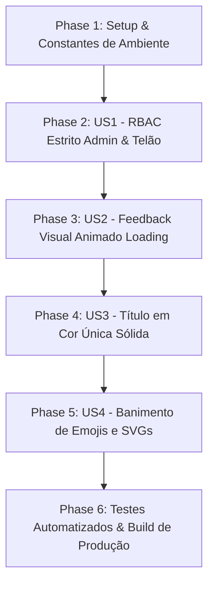

# Tasks: Controle de Acesso Restrito (Admin & Telão), Feedback Visual de Loading e Padronização de Interface

**Input**: Documentos de design em `/specs/005-controle-admin-feedback-visual/`  
**Prerequisites**: [plan.md](file:///c:/Users/thiago.luiz/Desktop/Desenvolvimento/votacao-confra/specs/005-controle-admin-feedback-visual/plan.md), [spec.md](file:///c:/Users/thiago.luiz/Desktop/Desenvolvimento/votacao-confra/specs/005-controle-admin-feedback-visual/spec.md), [research.md](file:///c:/Users/thiago.luiz/Desktop/Desenvolvimento/votacao-confra/specs/005-controle-admin-feedback-visual/research.md), [data-model.md](file:///c:/Users/thiago.luiz/Desktop/Desenvolvimento/votacao-confra/specs/005-controle-admin-feedback-visual/data-model.md), [contracts/api-contracts.md](file:///c:/Users/thiago.luiz/Desktop/Desenvolvimento/votacao-confra/specs/005-controle-admin-feedback-visual/contracts/api-contracts.md)

---

## Formato: `[ID] [P?] [Story] Descrição`
* **[P]**: Tarefa executável em paralelo (arquivos isolados e sem conflitos).
* **[US#]**: História de usuário à qual a tarefa pertence (US1 a US4).
* Caminhos de arquivos explícitos e critérios de aceite objetivos em cada item.

---

## Phase 1: Setup & Constantes de Autorização (Backend & Ambiente)

**Objetivo**: Configurar a lista oficial de administradores autorizados no ambiente e na base de dados.

- [x] T001 [P] [US1] Atualizar a variável de ambiente `ADMIN_EMAILS` nos arquivos [server/.env](file:///c:/Users/thiago.luiz/Desktop/Desenvolvimento/votacao-confra/server/.env) e [server/.env.example](file:///c:/Users/thiago.luiz/Desktop/Desenvolvimento/votacao-confra/server/.env.example) para conter exclusivamente a lista nominal dos 4 colaboradores (`thiago.luiz@colegiocarbonell.com.br,patricia.santos@colegiocarbonell.com.br,marina.ribeiro@colegiocarbonell.com.br,raquel.favatto@colegiocarbonell.com.br`).
- [x] T002 [US1] Atualizar `defaultDb.config.adminEmails` no arquivo [server/db.js](file:///c:/Users/thiago.luiz/Desktop/Desenvolvimento/votacao-confra/server/db.js) com os 4 e-mails oficiais e implementar sincronização defensiva em `getConfig()` para garantir que o Firestore (`config/app_state`) atualize e preserve a lista oficial em instâncias ativas.

---

## Phase 2: User Story 1 - RBAC Estrito para Painel Admin e Modo Telão (Priority: P1) 🎯 MVP

**Objetivo**: Garantir que apenas os 4 colaboradores autorizados recebam `isAdmin: true` e tenham acesso às telas e rotas de administração e telão, bloqueando qualquer outro colaborador com HTTP 403 e ocultando as abas na Navbar.

- [x] T003 [US1] Refatorar a função `isUserAdmin(email)` no arquivo [server/routes/auth.js](file:///c:/Users/thiago.luiz/Desktop/Desenvolvimento/votacao-confra/server/routes/auth.js) para normalizar os e-mails com `toLowerCase().trim()` e validar estritamente contra a lista oficial consolidada.
- [x] T004 [US1] Validar o middleware `adminMiddleware` em [server/routes/auth.js](file:///c:/Users/thiago.luiz/Desktop/Desenvolvimento/votacao-confra/server/routes/auth.js) e sua aplicação em [server/routes/admin.js](file:///c:/Users/thiago.luiz/Desktop/Desenvolvimento/votacao-confra/server/routes/admin.js), assegurando resposta padronizada HTTP 403 Forbidden para requisições de colaboradores sem privilégios.
- [x] T005 [P] [US1] Blindar o componente [client/src/App.jsx](file:///c:/Users/thiago.luiz/Desktop/Desenvolvimento/votacao-confra/client/src/App.jsx) para que as views `AdminPage` e `RevealPage` só sejam renderizadas se `user?.isAdmin === true`, forçando o retorno para `currentTab = 'voting'` caso um usuário não-admin tente navegar diretamente para essas abas.
- [x] T006 [P] [US1] Garantir no componente [client/src/components/Navbar.jsx](file:///c:/Users/thiago.luiz/Desktop/Desenvolvimento/votacao-confra/client/src/components/Navbar.jsx) que os botões de navegação "Admin" e "Telão" sejam renderizados exclusivamente quando `user?.isAdmin === true`.
- [x] T007 [P] [US1] Atualizar os atalhos de teste de desenvolvimento (DEV) no arquivo [client/src/components/LoginModal.jsx](file:///c:/Users/thiago.luiz/Desktop/Desenvolvimento/votacao-confra/client/src/components/LoginModal.jsx) para utilizar Thiago Luiz (Admin) e Mariana Santos (Colaborador Regular).

**Checkpoint**: MVP de autorização concluído. Colaboradores comuns só veem e acessam a votação, enquanto apenas o quarteto autorizado acessa Admin e Telão.

---

## Phase 3: User Story 2 - Feedback Visual Animado (Loading States) nos Controles de Status (Priority: P1)

**Objetivo**: Adicionar spinners de carregamento giratórios SVG nos botões de controle de status no painel administrativo durante requisições assíncronas, prevenindo múltiplos cliques e eliminando dúvidas do operador.

- [x] T008 [US2] Importar o ícone `<Loader2 />` da biblioteca `lucide-react` no arquivo [client/src/pages/AdminPage.jsx](file:///c:/Users/thiago.luiz/Desktop/Desenvolvimento/votacao-confra/client/src/pages/AdminPage.jsx).
- [x] T009 [US2] Substituir o estado booleano genérico `actionLoading` pelo estado discriminado `pendingAction` (tipo `string | null`) no arquivo [client/src/pages/AdminPage.jsx](file:///c:/Users/thiago.luiz/Desktop/Desenvolvimento/votacao-confra/client/src/pages/AdminPage.jsx).
- [x] T010 [US2] Atualizar a função `handleStatusChange(newStatus)` em [client/src/pages/AdminPage.jsx](file:///c:/Users/thiago.luiz/Desktop/Desenvolvimento/votacao-confra/client/src/pages/AdminPage.jsx) para setar `pendingAction = \`status-\${newStatus}\`` antes da chamada à API e resetar para `null` no bloco `finally`.
- [x] T011 [US2] Modificar os botões de controle de status ("Aguardando", "Abrir Votação", "Encerrar Votação") em [client/src/pages/AdminPage.jsx](file:///c:/Users/thiago.luiz/Desktop/Desenvolvimento/votacao-confra/client/src/pages/AdminPage.jsx) para renderizar `<Loader2 className="w-4 h-4 animate-spin" />` quando a respectiva ação estiver pendente, mantendo todos os botões com `disabled={!!pendingAction || ...}` durante a execução.
- [x] T012 [P] [US2] Aplicar o estado `pendingAction` também nas funções `handleSyncPhotos` (`pendingAction = 'sync-photos'`) e `handleResetVotes` (`pendingAction = 'reset-votes'`) em [client/src/pages/AdminPage.jsx](file:///c:/Users/thiago.luiz/Desktop/Desenvolvimento/votacao-confra/client/src/pages/AdminPage.jsx), exibindo `<Loader2 className="w-4 h-4 animate-spin" />` nos respectivos botões durante o processamento.

**Checkpoint**: Todos os botões de ação do painel administrativo exibem spinner animado em tempo real ao serem clicados, com proteção contra concorrência e duplo clique.

---

## Phase 4: User Story 3 - Título Principal Institucional em Cor Única Sólida (Priority: P2)

**Objetivo**: Adequar a tipografia da tela principal de votação, removendo o degradê/bicolor e aplicando cor única sólida institucional `#1e2a4d`.

- [x] T013 [US3] Atualizar o título principal `h1` no cabeçalho do arquivo [client/src/pages/VotingPage.jsx](file:///c:/Users/thiago.luiz/Desktop/Desenvolvimento/votacao-confra/client/src/pages/VotingPage.jsx) para exibir "Votação da Melhor Fantasia" integralmente na cor sólida `text-[#1e2a4d]`, removendo a divisão de tags `` com cor contrastante.

**Checkpoint**: Título principal perfeitamente sóbrio, limpo e em cor única conforme o Design System.

---

## Phase 5: User Story 4 - Varredura e Banimento Completo de Emojis em Favor de SVGs (Priority: P2)

**Objetivo**: Garantir que 100% dos elementos visuais utilizem ícones vetoriais SVG da biblioteca `lucide-react`, eliminando qualquer resquício de emoji ou caractere texto solto.

- [x] T014 [P] [US4] Importar o componente `<X />` de `lucide-react` no arquivo [client/src/pages/AdminPage.jsx](file:///c:/Users/thiago.luiz/Desktop/Desenvolvimento/votacao-confra/client/src/pages/AdminPage.jsx) e substituir o caractere textual `"✕"` no botão de fechar toast de notificação.
- [x] T015 [US4] Executar varredura em todo o código-fonte (`client/src/**/*` e `server/**/*`) para garantir ausência total de emojis unicode em JSX, HTML e strings de log.

**Checkpoint**: Conformidade visual absoluta sem emojis em toda a aplicação.

---

## Phase 6: Polish, Testes Automatizados e Validação Final

**Objetivo**: Validar a integridade funcional, segurança e ausência de regressões no projeto.

- [x] T016 Atualizar a bateria de testes automatizados no arquivo [server/scripts/testValidation.js](file:///c:/Users/thiago.luiz/Desktop/Desenvolvimento/votacao-confra/server/scripts/testValidation.js) para incluir asserções explícitas sobre os 4 administradores autorizados, bloqueio 403 de colaboradores comuns e integridade da configuração de `adminEmails`.
- [x] T017 Executar os testes automatizados com `node server/scripts/testValidation.js` e validar 100% de sucesso.
- [x] T018 Executar o build de produção do frontend (`npm run build` na pasta `client`) para assegurar compilação limpa sem erros de bundling ou lint.

---

## Dependências e Sequenciamento de Histórias de Usuário

## Estratégia de Entrega Incremental
1. **MVP (Fases 1 e 2)**: Garante a segurança imediata do sistema, restringindo o acesso aos 4 colaboradores e bloqueando a visualização de abas para todos os demais.
2. **Melhorias de Usabilidade e UX (Fases 3 a 5)**: Feedback visual com spinner nos botões de controle de status, ajuste do título principal para cor única e purificação dos ícones.
3. **Garantia de Qualidade (Fase 6)**: Testes automatizados cobrindo as regras de negócio e validação do build de produção.
