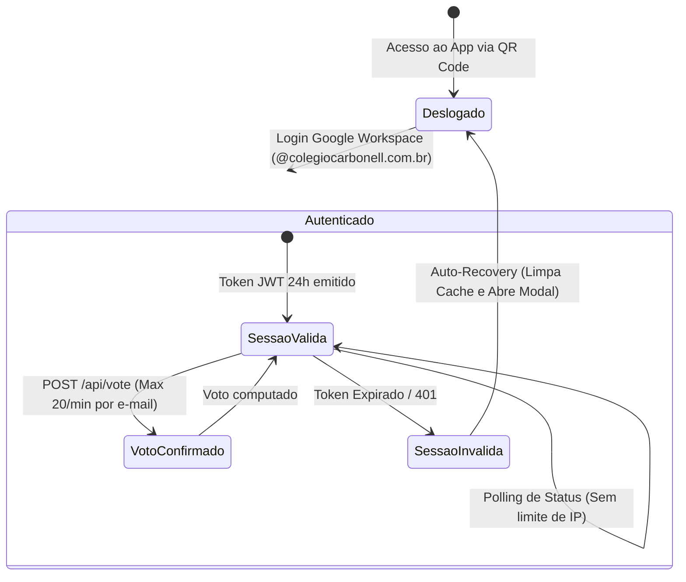

# Data Model: 006 - Blindagem de Produção e Estabilidade para o Dia da Votação

**Feature**: [spec.md](file:///c:/Users/thiago.luiz/Desktop/Desenvolvimento/votacao-confra/specs/006-blindagem-producao-dia-d/spec.md)  
**Date**: 2026-09-28  
**Status**: Concluído  

---

## 1. Entidades do Sistema e Estrutura de Dados

### 1.1 Sessão de Autenticação (JWT Payload)
Representa a credencial criptográfica gerada pelo backend após validação de token institucional do Google Workspace.

| Campo | Tipo | Descrição | Regras de Validação |
| :--- | :--- | :--- | :--- |
| `email` | String | E-mail institucional do colaborador | Obrigatório, lowercase, deve terminar com `@colegiocarbonell.com.br` |
| `name` | String | Nome de exibição do colaborador | Obrigatório |
| `picture` | String | URL da foto do perfil Google ou avatar | Opcional |
| `isAdmin` | Boolean | Flag indicando se é membro da comissão | `true` estritamente para os 4 e-mails autorizados |
| `iat` | Number | Timestamp de emissão (segundos) | Gerado automaticamente pelo JWT |
| `exp` | Number | Timestamp de expiração (segundos) | **24 horas** a partir da emissão (`now + 86400s`) |

---

### 1.2 Estado Global de Aplicação (`config/app_state`)
Persistido no Firestore, define as regras operacionais da urna.

| Campo | Tipo | Descrição | Valores Possíveis |
| :--- | :--- | :--- | :--- |
| `status` | String | Ciclo de vida da votação | `'waiting'` (Aguardando Início), `'open'` (Aberta), `'closed'` (Encerrada) |
| `title` | String | Título do evento | `'Festa de Confraternização - Melhor Fantasia'` |
| `allowVoteChange` | Boolean | Permissão para trocar o voto enquanto aberta | `true` |
| `adminEmails` | Array<String>| Lista dos 4 e-mails de administradores oficiais | Matriz imutável dos 4 administradores autorizados |

---

### 1.3 Registro de Voto Atômico (`votes/{voterEmail}`)
Documento individualizado e indexado pela chave do eleitor no Firestore, garantindo 1 voto ativo por colaborador com sigilo de apuração.

| Campo | Tipo | Descrição | Regras de Validação |
| :--- | :--- | :--- | :--- |
| `candidateId` | String | ID do colega escolhido | Deve existir no catálogo de candidatos |
| `voterEmail` | String | E-mail do colaborador eleitor | ID do documento, restrito a `@colegiocarbonell.com.br` |
| `voterName` | String | Nome do colaborador eleitor | Registro exclusivo para lista de presença |
| `timestamp` | Firestore Timestamp | Horário da confirmação do voto | Preenchido com `FieldValue.serverTimestamp()` |

---

## 2. Transições de Estado da Aplicação e Controle de Sessão

