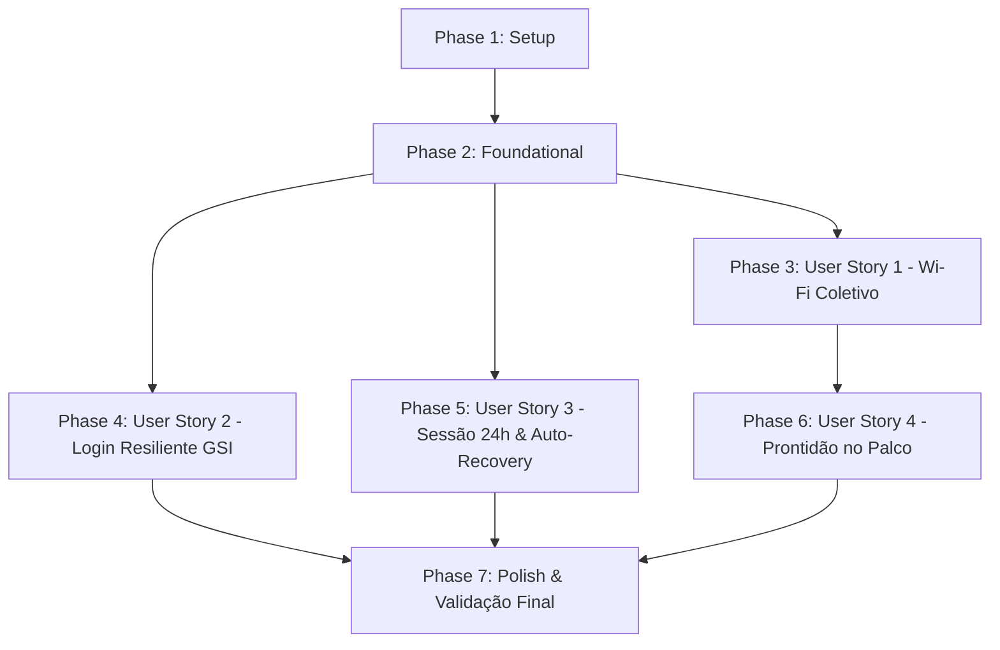

# Tasks: 006 - Blindagem de Produção e Estabilidade para o Dia da Votação

**Input**: Documentos de design de `/specs/006-blindagem-producao-dia-d/`  
**Prerequisites**: [plan.md](file:///c:/Users/thiago.luiz/Desktop/Desenvolvimento/votacao-confra/specs/006-blindagem-producao-dia-d/plan.md), [spec.md](file:///c:/Users/thiago.luiz/Desktop/Desenvolvimento/votacao-confra/specs/006-blindagem-producao-dia-d/spec.md), [research.md](file:///c:/Users/thiago.luiz/Desktop/Desenvolvimento/votacao-confra/specs/006-blindagem-producao-dia-d/research.md), [data-model.md](file:///c:/Users/thiago.luiz/Desktop/Desenvolvimento/votacao-confra/specs/006-blindagem-producao-dia-d/data-model.md), [contracts/api-contracts.md](file:///c:/Users/thiago.luiz/Desktop/Desenvolvimento/votacao-confra/specs/006-blindagem-producao-dia-d/contracts/api-contracts.md)  
**Organization**: Tarefas atomizadas, agrupadas por história de usuário para implementação e validação independentes.

---

## Formato: `- [ ] [ID] [P?] [Story?] Descrição com caminho de arquivo`

- **[P]**: Tarefa executável em paralelo (arquivos distintos, sem dependência direta)
- **[Story]**: Rótulo da história correspondente (`[US1]`, `[US2]`, `[US3]`, `[US4]`)

---

## Phase 1: Setup (Infraestrutura Compartilhada)

**Objetivo**: Preparação e alinhamento de scripts operacionais de deploy e infraestrutura para alta disponibilidade.

- [x] T001 [P] Configurar parâmetro `--min-instances 1` no script de deploy do servidor em `package.json` para eliminar cold-start no dia do evento
- [x] T002 [P] Atualizar variáveis de ambiente de produção e documentação em `server/.env.example` e `server/env.yaml` com diretrizes de estabilidade

---

## Phase 2: Foundational (Pré-requisitos Bloqueantes)

**Objetivo**: Infraestrutura de sessão e middlewares essenciais compartilhados entre as histórias.

- [x] T003 Atualizar emissão de token JWT para validade de 24 horas (`expiresIn: '24h'`) em `server/routes/auth.js`
- [x] T004 Implementar interceptor global de resposta HTTP 401 para auto-recovery e limpeza de sessão expirada em `client/src/api.js`

---

## Phase 3: User Story 1 - Acesso Concorrente Massivo no Wi-Fi da Festa (Prioridade: P1) 🎯 MVP

**Objetivo**: Garantir que mais de 160 smartphones conectados ao mesmo Wi-Fi não recebam erro HTTP 429 decorrente do polling contínuo.

- [x] T005 [US1] Isolar as rotas de polling de status (`/api/vote/status`) e health check do limitador global por IP em `server/index.js`
- [x] T006 [US1] Ajustar escopo do middleware de rate limit global para rotas mutáveis e manter `submitVoteLimiter` indexado estritamente por e-mail em `server/routes/vote.js`
- [x] T007 [US1] Adicionar teste de alta frequência de polling concorrente sob o mesmo IP no script de validação em `server/scripts/testValidation.js`

---

## Phase 4: User Story 2 - Login Resiliente do Google em Conexões Móveis (Prioridade: P1)

**Objetivo**: Garantir renderização imediata do botão institucional do Google no modal de login, mesmo em conexões móveis com latência ou oscilação.

- [x] T008 [US2] Implementar espera ativa (polling a cada 100ms até 4s) para disponibilidade do SDK `window.google.accounts.id` em `client/src/components/LoginModal.jsx`
- [x] T009 [US2] Adicionar estado de feedback visual com spinner vetorial e mensagem de carregamento durante a inicialização do SDK em `client/src/components/LoginModal.jsx`
- [x] T010 [US2] Adicionar tratamento defensivo de timeout com botão de recarga manual amigável em caso de falha de conexão com os servidores do Google em `client/src/components/LoginModal.jsx`

---

## Phase 5: User Story 3 - Sessão Duradoura e Recuperação Transparente (Prioridade: P1)

**Objetivo**: Evitar erros de sessão expirada durante a festa e reabrir o modal de login suavemente caso uma credencial seja revogada ou expire.

- [x] T011 [US3] Conectar o evento de sessão expirada do cliente HTTP ao estado global de autenticação em `client/src/App.jsx`
- [x] T012 [US3] Adicionar teste automatizado de verificação da duração do token JWT (exp - iat = 86400s) em `server/scripts/testValidation.js`

---

## Phase 6: User Story 4 - Prontidão Instantânea e Alta Disponibilidade no Palco (Prioridade: P2)

**Objetivo**: Assegurar que a comissão organizadora execute o procedimento de abertura sem atrasos ou dados prévios de testes.

- [x] T013 [US4] Documentar checklist operacional no painel administrativo e instruções no `README.md` para zerar votos e colocar a urna em "Aguardando Início" antes da festa

---

## Phase 7: Polish & Cross-Cutting Concerns

**Objetivo**: Sanitização de código, verificação de linters e testes finais de ponta a ponta.

- [x] T014 Sanitizar warning do React linter (`react(set-state-in-effect)`) na navegação defensiva em `client/src/App.jsx`
- [x] T015 Executar bateria de validação completa do servidor com `npm --prefix server test`
- [x] T016 Executar verificação de linters do frontend com `npm --prefix client run lint`
- [x] T017 Executar compilação de produção com `npm --prefix client run build`

---

## Dependências e Ordem de Execução

---

## Estratégia de Implementação e MVP

1. **MVP (Fase 1 a Fase 3):** Concluir imediatamente a infraestrutura básica e a blindagem contra o gargalo de Wi-Fi coletivo (User Story 1).
2. **Incremento 2 (Fases 4 e 5):** Aplicar a resiliência no carregamento móvel do Google GSI e o auto-recovery de sessão de 24h.
3. **Incremento 3 (Fases 6 e 7):** Checklist operacional da comissão e sanitização final com 100% dos testes e linters verdes.
