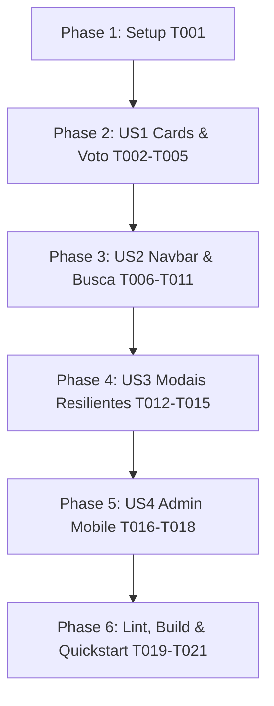

# Tasks: 007-responsividade-mobile - Otimização de Responsividade e Experiência Mobile

**Input**: Design documents from `/specs/007-responsividade-mobile/`  
**Prerequisites**: [plan.md](file:///c:/Users/thiago.luiz/Desktop/Desenvolvimento/votacao-confra/specs/007-responsividade-mobile/plan.md), [spec.md](file:///c:/Users/thiago.luiz/Desktop/Desenvolvimento/votacao-confra/specs/007-responsividade-mobile/spec.md), [research.md](file:///c:/Users/thiago.luiz/Desktop/Desenvolvimento/votacao-confra/specs/007-responsividade-mobile/research.md), [data-model.md](file:///c:/Users/thiago.luiz/Desktop/Desenvolvimento/votacao-confra/specs/007-responsividade-mobile/data-model.md), [contracts/ui-contracts.md](file:///c:/Users/thiago.luiz/Desktop/Desenvolvimento/votacao-confra/specs/007-responsividade-mobile/contracts/ui-contracts.md)  
**Organization**: Tarefas agrupadas por História de Usuário (P1 e P2) para viabilizar execução e testes independentes.

---

## Formato das Tarefas: `[ID] [P?] [Story] Descrição com caminho do arquivo`

- **[P]**: Pode rodar em paralelo (arquivos distintos, sem dependência mútua)
- **[Story]**: Identificador da história de usuário (US1, US2, US3, US4)

---

## Phase 1: Setup & Validações Iniciais

**Propósito**: Garantir estado limpo do ambiente de frontend antes de iniciar modificações de interface.

- [x] T001 Verificar integridade de dependências e build do cliente React em `client/package.json`

---

## Phase 2: User Story 1 - Reconhecimento Facial Desobstruído e Votação no Smartphone (Priority: P1) 🎯 MVP

**Objetivo**: Colaboradores visualizam fotos nítidas dos colegas com rostos desobstruídos e operam o voto com facilidade na grade móvel.  
**Critério de Teste Independente**: Acessar a galeria em 360px; constatar que a foto preenche o card com foco superior (`object-cover object-top`), a fantasia fica abaixo do nome e o botão "Trocar Voto" possui altura uniforme de 44px sem desnível na grade.

- [x] T002 [US1] Ajustar proporção e enquadramento da foto para `w-full h-full object-cover object-top sm:object-center` em `client/src/components/CandidateCard.jsx`
- [x] T003 [US1] Reposicionar a etiqueta da fantasia (`costumeName`) para abaixo do nome e departamento, mantendo apenas badges de voto no topo da foto em `client/src/components/CandidateCard.jsx`
- [x] T004 [US1] Ajustar o texto do botão de transferência de voto no mobile para `"Trocar Voto"` (`sm:hidden`) e `"Mudar voto para cá"` (`hidden sm:inline-flex`) em `client/src/components/CandidateCard.jsx`
- [x] T005 [US1] Permitir até 2 linhas (`line-clamp-2`) para o nome do candidato mantendo altura mínima uniforme do card em `client/src/components/CandidateCard.jsx`

**Checkpoint US1**: Os cards estão visualmente desobstruídos, as fotos são nítidas no mobile e a grade de 2 colunas permanece 100% nivelada.

---

## Phase 3: User Story 2 - Navegação Fluida sem Sobreposição e Busca sem Auto-Zoom no iOS (Priority: P1)

**Objetivo**: Colaborador pesquisa colegas rapidamente sem saltos de zoom no Safari (iPhone) e sem barras encobrindo conteúdo.  
**Critério de Teste Independente**: Tocar na busca no iPhone simulado/real e verificar ausência de zoom automático; testar o botão 'X' de limpeza instantânea; checar que a navbar não quebra linha em 360px e o banner de status não sobrepõe títulos.

- [x] T006 [P] [US2] Ocultar botão `"Votação"` para colaboradores comuns no mobile (`hidden sm:inline-flex`) e compactar texto do logo em `client/src/components/Navbar.jsx`
- [x] T007 [P] [US2] Resolver sobreposição do banner móvel de status da votação garantindo espaçamento harmônico no cabeçalho em `client/src/components/Navbar.jsx` e `client/src/pages/VotingPage.jsx`
- [x] T008 [US2] Aplicar tipografia `text-base sm:text-sm` (16px no mobile) no campo de pesquisa para eliminar auto-zoom no Safari iOS em `client/src/pages/VotingPage.jsx`
- [x] T009 [US2] Adicionar botão de limpeza rápida de pesquisa (ícone 'X' com touch target de 36px) no campo de busca em `client/src/pages/VotingPage.jsx`
- [x] T010 [US2] Centralizar horizontalmente as notificações Toast no mobile (`top-20 inset-x-4 max-w-sm mx-auto`) em `client/src/pages/VotingPage.jsx`
- [x] T011 [US2] Compactar margens verticais do cabeçalho Hero no mobile para exibir a primeira linha de cards na primeira dobra em `client/src/pages/VotingPage.jsx`

**Checkpoint US2**: A navegação superior e a busca funcionam com estabilidade nativa no iOS/Android, sem sobreposição de barras nem zoom indesejado.

---

## Phase 4: User Story 3 - Modais Resilientes sob Teclado Virtual e Telas Compactas (Priority: P2)

**Objetivo**: Modais de confirmação de voto e login cabem integralmente em telas pequenas mesmo sob teclado virtual aberto.  
**Critério de Teste Independente**: Abrir o modal de confirmação e login em 360x667px com teclado simulado; constatar rolagem vertical interna e acessibilidade aos botões de ação.

- [x] T012 [P] [US3] Configurar limite de altura `max-h-[90dvh]` com `overflow-y-auto` e padding adaptado `p-5 sm:p-8` em `client/src/components/VoteModal.jsx`
- [x] T013 [P] [US3] Configurar limite de altura `max-h-[90dvh]` com `overflow-y-auto` e padding adaptado `p-5 sm:p-8` em `client/src/components/LoginModal.jsx`
- [x] T014 [US3] Conter a largura do botão Google Sign-In no `LoginModal.jsx` para evitar overflow lateral em aparelhos com 360px de largura
- [x] T015 [US3] Ajustar tamanho de fonte para `text-base sm:text-xs` nos inputs de desenvolvimento local do `LoginModal.jsx` para evitar auto-zoom no iOS

**Checkpoint US3**: Nenhum botão de modal é cortado fora da viewport e as ações de confirmar voto e logar funcionam perfeitamente em telas compactas.

---

## Phase 5: User Story 4 - Apuração Mobile da Comissão Organizadora sem Rolagem Horizontal (Priority: P2)

**Objetivo**: Administradores acompanham a contagem e ranking parcial pelo smartphone durante o evento em formato de cards verticais.  
**Critério de Teste Independente**: Acessar o painel admin em viewport móvel de 390px; verificar a apuração em cards verticais com foto, colocação, votos e porcentagem sem necessidade de rolagem horizontal.

- [x] T016 [US4] Criar visualização de apuração em cards/lista de ranking vertical para telas móveis (`block md:hidden`) mantendo a tabela tabular no desktop (`hidden md:block`) em `client/src/pages/AdminPage.jsx`
- [x] T017 [US4] Formatar a lista de presença e auditoria em lista fluida sem rolagem horizontal no mobile em `client/src/pages/AdminPage.jsx`
- [x] T018 [US4] Organizar os botões de controle de status ("Aguardando", "Abrir Votação", "Encerrar Votação", "Modo Telão") em grade consistente com área mínima de toque de 44px em `client/src/pages/AdminPage.jsx`

**Checkpoint US4**: A comissão organizadora consegue gerenciar a votação e auditar os votos pelo celular com ergonomia e rapidez.

---

## Phase 6: Polimento Final & Validação Contínua (Cross-Cutting)

**Propósito**: Validação rigorosa em múltiplos viewports e garantia de zero erros de lint ou build.

- [x] T019 Executar linter `npm run lint` no diretório `client/` para assegurar ausência de erros de sintaxe
- [x] T020 Executar build de produção `npm run build` no diretório `client/` validando empacotamento do Vite
- [x] T021 Validar roteiro completo de testes móveis em `specs/007-responsividade-mobile/quickstart.md` nos viewports 360px, 390px e 430px

---

## Dependências e Ordem de Implementação

---

## Estratégia de Entrega Incremental (MVP)

1. **Incremento 1 (MVP - US1):** Cards perfeitamente nivelados, fotos de alta visibilidade e reconhecimento facial desobstruído.
2. **Incremento 2 (US2):** Navbar limpa e busca rápida sem auto-zoom compulsório no iPhone.
3. **Incremento 3 (US3):** Modais confortáveis mesmo sob teclado virtual aberto.
4. **Incremento 4 (US4):** Painel do gestor fluido e ergonômico no smartphone.
