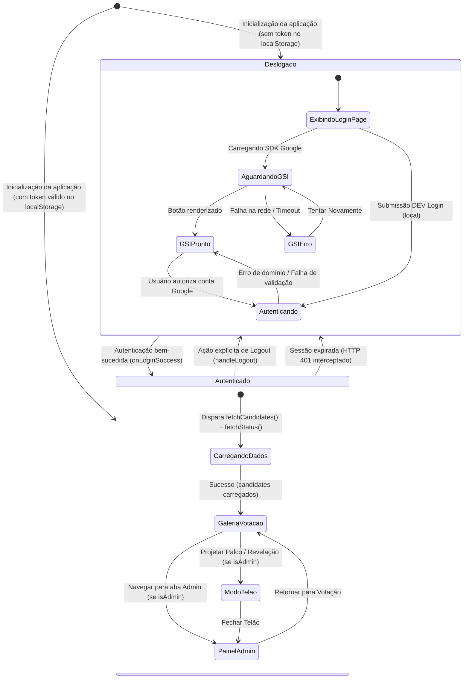

# Data Model & State Architecture: Tela de Login Antecedente Obrigatória (Padrão cv-face)

**Spec**: [spec.md](file:///c:/Users/thiago.luiz/Desktop/Desenvolvimento/votacao-confra/specs/008-tela-de-login/spec.md)  
**Date**: 2026-09-29  
**Feature**: `008-tela-de-login`  

---

## 1. Entidades de Dados

### 1.1 `UserSession` (Armazenamento Local e Estado em Memória)

Representa a credencial autenticada no cliente e a sessão JWT emitida pelo backend.

| Campo | Tipo | Descrição | Regras de Validação |
| :--- | :--- | :--- | :--- |
| `email` | `string` | E-mail do colaborador | Deve terminar obrigatoriamente com `@colegiocarbonell.com.br`. |
| `name` | `string` | Nome completo do colaborador | Extraído do token Google ou payload autenticado. |
| `picture` | `string` (opcional) | URL da foto de perfil corporativa | URL segura HTTPS ou fallback dinâmico. |
| `isAdmin` | `boolean` | Flag de permissão administrativa | Atribuída no backend apenas para os 5 administradores do evento. |
| `token` | `string` | Token de autenticação JWT | Assinado criptograficamente com segredo institucional; validade de 24h. |

### 1.2 `Candidate` (Catálogo de Colaboradores e Fotos)

Disponível para consumo exclusivamente após a validação da sessão.

| Campo | Tipo | Descrição |
| :--- | :--- | :--- |
| `id` | `string` | Identificador único do participante. |
| `name` | `string` | Nome completo do colaborador. |
| `email` | `string` | E-mail institucional do colaborador. |
| `photoUrl` | `string` | Caminho relativo da fotografia (`/photos/nome-da-foto.jpg`). |
| `department` | `string` | Setor ou departamento institucional. |
| `costumeName` | `string` | Nome do personagem ou fantasia caracterizada. |

---

## 2. Máquina de Estados da Aplicação (`App.jsx`)

A aplicação passa a operar em uma máquina de estados estrita orientada pela presença de autenticação:



---

## 3. Estado Local da Página de Login (`LoginPage.jsx`)

```typescript
interface LoginPageState {
  error: string;                    // Mensagem de erro para feedback do usuário
  loading: boolean;                  // Indica chamada de validação do token em andamento
  gsiStatus: 'loading' | 'ready' | 'error'; // Ciclo de vida do botão Google Identity Services
  gsiRetryCount: number;             // Contador para re-tentativas de inicialização do SDK
  // Campos visíveis apenas em ambiente local (DEV):
  devEmailInput: string;             // Campo de entrada de e-mail de teste
  devNameInput: string;              // Campo opcional de nome para testes rápidos
}
```

---

## 4. Políticas de Transição e Ciclo de Vida de Dados

1. **Estado Inicial (Boot):**
   - Ao iniciar, o `App.jsx` lê o `getStoredUser()` e `getStoredToken()`.
   - Se for nulo (`!user`):
     - `candidates` é mantido como array vazio (`[]`);
     - `loading` de candidatos não é disparado;
     - A interface renderiza estritamente `<LoginPage onLoginSuccess={handleLoginSuccess} />`.
2. **Ao Concluir Login com Sucesso:**
   - O `handleLoginSuccess(userData)` atualiza o estado `user`, grava as credenciais locais e dispara `fetchCandidates()` e `syncStatus()`.
   - A `LoginPage` é desmontada e a aplicação transita para o layout autenticado (`Navbar`, `VotingPage`, `footer`).
3. **Ao Efetuar Logout:**
   - O `handleLogout` remove o token e dados do usuário do `localStorage`;
   - O estado `user` é resetado para `null`;
   - O estado `candidates` é resetado para `[]`;
   - O estado `currentVote` é resetado para `null`;
   - A `Navbar` é desmontada e a `LoginPage` assume a tela instantaneamente.
4. **Auto-Recovery por Expiração de Token (401):**
   - O interceptor de rede em `client/src/api.js` captura respostas HTTP 401 de qualquer endpoint.
   - Emite o evento global de janela `carbonell:session-expired`.
   - O listener no `App.jsx` zera `user`, zera `candidates` e comuta a visualização para a `LoginPage`.
