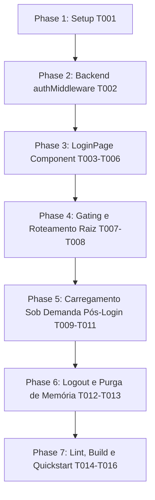

# Tasks: 008-tela-de-login - Tela de Login Antecedente Obrigatória e Bloqueio de Acesso a Fotos (Padrão cv-face)

**Input**: Documentos de design em `/specs/008-tela-de-login/`  
**Prerequisites**: [plan.md](file:///c:/Users/thiago.luiz/Desktop/Desenvolvimento/votacao-confra/specs/008-tela-de-login/plan.md), [spec.md](file:///c:/Users/thiago.luiz/Desktop/Desenvolvimento/votacao-confra/specs/008-tela-de-login/spec.md), [research.md](file:///c:/Users/thiago.luiz/Desktop/Desenvolvimento/votacao-confra/specs/008-tela-de-login/research.md), [data-model.md](file:///c:/Users/thiago.luiz/Desktop/Desenvolvimento/votacao-confra/specs/008-tela-de-login/data-model.md), [contracts/auth-contracts.md](file:///c:/Users/thiago.luiz/Desktop/Desenvolvimento/votacao-confra/specs/008-tela-de-login/contracts/auth-contracts.md)  
**Organization**: Tarefas agrupadas por História de Usuário (P1 e P2) para permitir implementação e testes independentes de cada incremento.

---

## Formato das Tarefas: `[ID] [P?] [Story] Descrição com caminho do arquivo`

- **[P]**: Pode rodar em paralelo (arquivos distintos, sem dependência mútua)
- **[Story]**: Identificador da história de usuário (US1, US2, US3, US4)

---

## Phase 1: Setup & Validações Iniciais

**Propósito**: Preparação do ambiente e verificação de arquivos base.

- [x] T001 Verificar a integridade do logotipo oficial `client/public/images/logo-fundo-branco.png` e dependências no `client/package.json`

---

## Phase 2: Foundational (Blindagem de Backend & Segurança)

**Propósito**: Bloqueio de dados confidenciais na camada de API antes das alterações de frontend.

- [x] T002 Aplicar `authMiddleware` na rota `GET /api/vote/candidates` em `server/routes/vote.js` para exigir token JWT e retornar HTTP 401 em acessos anônimos

---

## Phase 3: User Story 1 - Recepção com Tela de Login Dedicada no Padrão cv-face (Priority: P1) 🎯 MVP

**Objetivo**: Criar o componente de página inteira `LoginPage.jsx` no padrão visual idêntico ao projeto `cv-face` (layout centralizado, fundo claro `#f8fafc`, logotipo oficial de até 200px, título sólido em azul marinho, instrução institucional e botão Google).  
**Critério de Teste Independente**: Renderizar `LoginPage.jsx` isoladamente; constatar alinhamento vertical e horizontal centralizado, logotipo correto, mensagens sem emojis e botão Google Sign-In operacional.

- [x] T003 [P] [US1] Criar o componente de página dedicada `client/src/pages/LoginPage.jsx` com a estrutura de container centralizado `.login-container` espelhada no `cv-face`
- [x] T004 [US1] Incorporar logotipo oficial (`/images/logo-fundo-branco.png` com max 200px), título institucional sólido "Votação do Melhor Traje" e mensagem orientativa em `client/src/pages/LoginPage.jsx`
- [x] T005 [US1] Integrar o botão oficial do Google Identity Services (GSI) com restrição a `colegiocarbonell.com.br` e estados de loading/erro com retry em `client/src/pages/LoginPage.jsx`
- [x] T006 [US1] Adicionar formulário de testes rápidos de desenvolvimento condicionado estritamente a `import.meta.env.DEV` em `client/src/pages/LoginPage.jsx`

**Checkpoint US1**: A página `LoginPage` está criada, estilizada no padrão exato do `cv-face` e pronta para autenticar colaboradores.

---

## Phase 4: User Story 2 - Bloqueio Absoluto de Exibição e Carregamento de Fotos antes do Login (Priority: P1)

**Objetivo**: Garantir que nenhum usuário deslogado visualize fotos, nomes de colegas, barra de navegação ou qualquer dado de candidatos.  
**Critério de Teste Independente**: Acessar o sistema em janela anônima; validar que apenas a `LoginPage` é montada, o array `candidates` fica vazio e nenhuma requisição de fotos ou candidatos é feita pela rede.

- [x] T007 [US2] Modificar o ciclo de vida inicial em `client/src/App.jsx` para não disparar `fetchCandidates()` enquanto `user === null`
- [x] T008 [US2] Implementar roteamento raiz condicional em `client/src/App.jsx` para renderizar exclusivamente `<LoginPage onLoginSuccess={handleLoginSuccess} />` quando `!user`, omitindo Navbar, VotingPage e rodapé

**Checkpoint US2**: Barreira de gating 100% ativa no frontend e backend; zero fotos ou candidatos trafegados ou renderizados sem login.

---

## Phase 5: User Story 3 - Transição Fluida para a Galeria de Votação após Autenticação Válida (Priority: P1)

**Objetivo**: Conectar o fluxo pós-login para carregar os candidatos sob demanda e transitar suavemente para a galeria de votação ou painel admin.  
**Critério de Teste Independente**: Autenticar com sucesso via Google institucional ou DEV; verificar indicador de carregamento rápido e renderização completa da galeria de fotos com a `Navbar`.

- [x] T009 [US3] Implementar o disparo de `fetchCandidates()` sob demanda após a confirmação da sessão em `client/src/App.jsx`
- [x] T010 [US3] Exibir indicador visual de progresso (`animate-spin`) durante o carregamento dos participantes pós-login em `client/src/App.jsx`
- [x] T011 [US3] Garantir restauração de sessão salva no `localStorage` ao recarregar a página (F5) mantendo acesso imediato para usuários já logados em `client/src/App.jsx`

**Checkpoint US3**: Autenticação fluida e liberação segura da votação para colaboradores institucionais.

---

## Phase 6: User Story 4 - Logout e Encerramento de Sessão com Retorno à Tela de Login (Priority: P2)

**Objetivo**: Destruição segura de sessão no logout ou expiração de token, com purga imediata das fotos da memória e retorno à `LoginPage`.  
**Critério de Teste Independente**: Clicar em "Sair" na `Navbar`; verificar que o `localStorage` é limpo, o estado de candidatos é esvaziado (`[]`) e a tela de login ressurge instantaneamente.

- [x] T012 [US4] Atualizar a função `handleLogout` em `client/src/App.jsx` para esvaziar o estado de candidatos (`setCandidates([])`) e comutar imediatamente para a `LoginPage`
- [x] T013 [US4] Atualizar o listener de evento `carbonell:session-expired` em `client/src/App.jsx` para purgar os candidatos e reabrir a `LoginPage` em caso de erro 401

**Checkpoint US4**: Encerramento de sessão completo com proteção contra vazamento de fotos em aparelhos compartilhados.

---

## Phase 7: Polimento Final & Validação Contínua (Cross-Cutting)

**Propósito**: Validação de qualidade de código, empacotamento de produção e execução do roteiro de testes.

- [x] T014 [P] Executar o linter `npm run lint` no diretório `client/` assegurando zero erros ou advertências
- [x] T015 [P] Executar o build de produção `npm run build` no diretório `client/` validando ausência de quebras de compilação
- [x] T016 Executar validação de ponta a ponta dos cenários 1 a 5 descritos em `specs/008-tela-de-login/quickstart.md`

---

## Dependências e Ordem de Implementação

---

## Estratégia de Entrega Incremental (MVP)

1. **Incremento 1 (MVP)**: Tarefas T001 até T008 entregam o bloqueio essencial (gating): backend protegido com 401 e frontend exibindo a tela de login dedicada no padrão `cv-face` sem expor fotos.
2. **Incremento 2**: Tarefas T009 até T011 entregam o fluxo completo de desbloqueio e transição pós-login.
3. **Incremento 3**: Tarefas T012 até T013 entregam o encerramento seguro e auto-recovery de sessão.
4. **Incremento 4**: Tarefas T014 até T016 garantem a blindagem de produção e conformidade total com o Design System.
