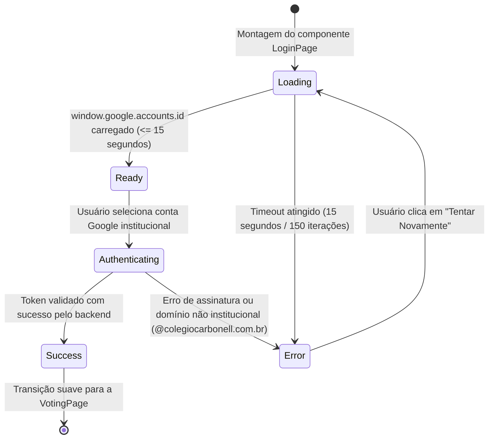

# Data Model: Blindagem de Concorrência, FinOps e Tolerância a Falhas no Dia D

**Spec**: [spec.md](./spec.md) | **Date**: 2026-09-29

---

## 1. Estrutura de Cache em Memória no Backend

### 1.1 Cache de Configuração (`configCache`)
Armazena a configuração operacional volátil em memória para evitar leituras repetidas em `config/app_state`.

```typescript
interface ConfigCache {
  data: AppConfig | null;
  expiresAt: number; // Unix timestamp em milissegundos (Date.now() + 10_000)
}

interface AppConfig {
  status: 'waiting' | 'open' | 'closed';
  title: string;
  allowVoteChange: boolean;
  adminEmails: string[];
}
```

- **TTL:** 10.000 ms (10 segundos).
- **Invalidação:** Executada de forma atômica pela função `invalidateConfigCache()` ao acionar mutações administrativas de configuração.

---

## 2. Entidade de Voto Pontual (`UserVote`)

Documento único lido e gravado na coleção `votes` do Firestore, utilizando o e-mail normalizado do colaborador como chave primária:

```typescript
// Caminho no Firestore: votes/{normalizedEmail}
interface UserVoteRecord {
  candidateId: string;       // ID do candidato escolhido (ex: "c_a1b2c3d4e5f6")
  voterEmail: string;        // E-mail institucional em minúsculas (ex: "fulano.silva@colegiocarbonell.com.br")
  voterName: string;         // Nome para auditoria
  timestamp: string | FieldValue; // Timestamp da submissão
}
```

### Operação de Busca Pontual (`getVoteByEmail`)
- **Entrada:** `email: string` (ex: `"thiago.luiz@colegiocarbonell.com.br"`)
- **Consulta:** `db.collection('votes').doc(normalizedEmail).get()`
- **Saída:** `{ candidateId: string, timestamp: string } | null`
- **Custo de Leitura:** Exatamente **1 leitura de documento** no Firestore se o usuário já votou, ou 1 leitura de documento inexistente caso não tenha votado. **Zero varreduras de coleção.**

---

## 3. Contrato de Resposta do Polling de Status (`/api/vote/status`)

Payload unificado retornado ao frontend:

```typescript
interface VoteStatusResponse {
  status: 'waiting' | 'open' | 'closed'; // Status global da votação
  title: string;                         // Título oficial do evento
  allowVoteChange: boolean;              // Permissão de troca de voto
  totalCandidates: number;               // Contagem de participantes (lido do cache em memória)
  userVote: {
    candidateId: string;                 // ID do candidato votado por este usuário
    timestamp: string;                   // Data/hora da submissão
  } | null;                              // Nulo se usuário não votou ou requisição for anônima
}
```

---

## 4. Máquina de Estados de Autenticação na Tela de Login (`LoginPage.jsx`)

Estados reativos que controlam o ciclo de vida do botão Google Sign-In sob condições reais de rede:


