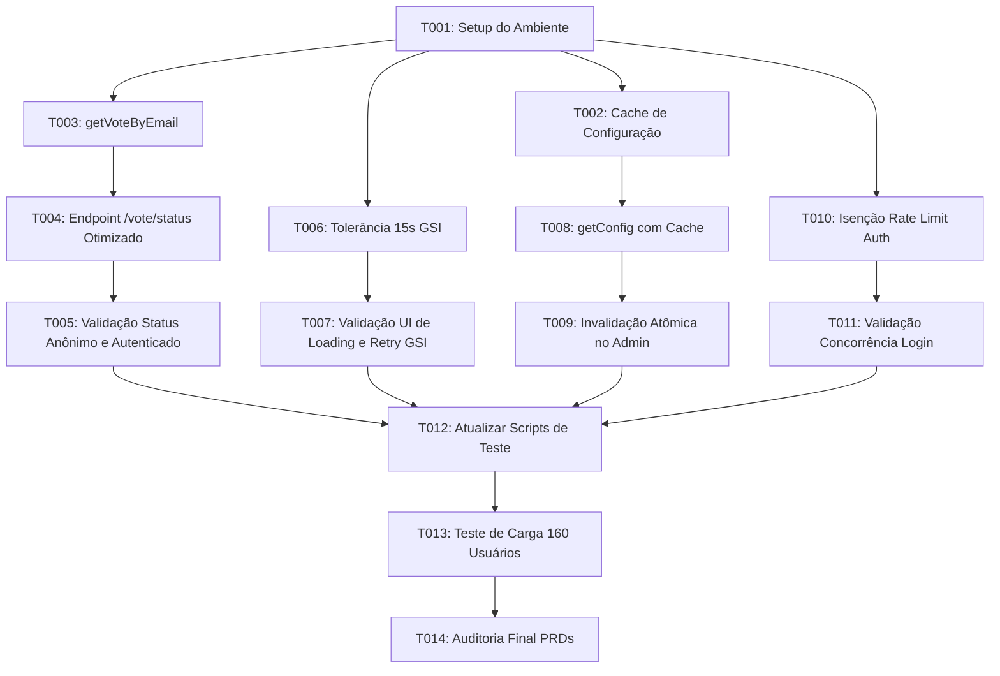

# Tasks: Blindagem de Concorrência, Otimização FinOps e Tolerância a Falhas no Dia D

**Input**: Documentos de design em `specs/009-blindagem-concorrencia-dia-d/`  
**Prerequisites**: [plan.md](./plan.md) (obrigatório), [spec.md](./spec.md) (obrigatório), [research.md](./research.md), [data-model.md](./data-model.md), [contracts/api-contracts.md](./contracts/api-contracts.md), [quickstart.md](./quickstart.md)  
**Organization**: Tarefas agrupadas por fases e por histórias de usuário para entrega incremental e teste independente.

---

## Format: `[ID] [P?] [Story?] Description`

- **[P]**: Tarefa executável em paralelo (arquivos distintos, sem dependência mútua)
- **[Story]**: Identificador da história de usuário correspondente (`[US1]`, `[US2]`, `[US3]`, `[US4]`)
- Caminhos absolutos/relativos de arquivos incluídos em todas as descrições

---

## Phase 1: Setup (Preparação e Validação do Ambiente)

**Propósito**: Preparação do ambiente de desenvolvimento e garantia das dependências necessárias.

- [X] T001 Verificar a branch ativa `antigravity-009/feat-blindagem-concorrencia-dia-d` e integridade das dependências em `package.json` e `server/package.json`

---

## Phase 2: Foundational (Infraestrutura de Banco e Cache)

**Propósito**: Componentes essenciais de acesso a dados que servem de pré-requisito para as histórias de usuário.

**⚠️ CRITICAL**: Nenhuma história de usuário pode ser iniciada antes da conclusão desta fase.

- [X] T002 [P] Implementar estrutura de cache em memória para a configuração global com TTL de 10 segundos e função de invalidação `invalidateConfigCache()` em `server/db.js`
- [X] T003 [P] Implementar a função `getVoteByEmail(email)` para consulta pontual de documento único (`votes/{normalizedEmail}`) sem varredura em `server/db.js`

**Checkpoint**: Infraestrutura de dados preparada para a rota de status e controles administrativos.

---

## Phase 3: User Story 1 - Consulta Leve e Eficiente do Status de Votação (Priority: P1) 🎯 MVP

**Goal**: Eliminar o gargalo de mais de 2.000 leituras/segundo no Firestore substituindo a varredura completa da coleção `votes` por busca pontual exclusiva do próprio colaborador autenticado.

**Independent Test**: Invocar `GET /api/vote/status` com o token de um colaborador e verificar tempo de resposta < 50ms, confirmando que apenas o documento pontual desse eleitor foi lido e que requisições anônimas geram zero leituras de votos.

- [X] T004 [US1] Modificar o endpoint `GET /api/vote/status` em `server/routes/vote.js` para usar `getVoteByEmail` condicionado à presença de token JWT autenticado e remover a chamada a `getVotes()`
- [X] T005 [US1] Validar que requisições anônimas em `GET /api/vote/status` retornam `userVote: null` sem executar nenhuma consulta de voto no Firestore em `server/routes/vote.js`

**Checkpoint**: User Story 1 completa e testável de forma independente. Rota de status otimizada e FinOps protegido.

---

## Phase 4: User Story 2 - Resiliência no Carregamento do Login em Wi-Fi Congestionado (Priority: P1)

**Goal**: Assegurar que colaboradores em conexões de alta latência ou Wi-Fi saturado não recebam avisos prematuros de indisponibilidade do Google.

**Independent Test**: Simular atraso de rede e confirmar que a tela de login tolera até 15 segundos antes de apresentar estado de erro, renderizando o botão oficial suavemente assim que o SDK inicializar.

- [X] T006 [US2] Estender o teto de espera ativa do Google Identity Services (GSI) para 150 tentativas de 100ms (15 segundos) em `client/src/pages/LoginPage.jsx`
- [X] T007 [US2] Preservar a exibição contínua do indicador animado de carregamento (`Loader2`) e o botão funcional de retentativa manual (`RefreshCw`) em `client/src/pages/LoginPage.jsx`

**Checkpoint**: User Story 2 completa. Autenticação na festa resistente a oscilações de Wi-Fi e 4G.

---

## Phase 5: User Story 3 - Cache de Configuração com Invalidação Atômica pelo Administrador (Priority: P2)

**Goal**: Reduzir em mais de 90% as leituras em `config/app_state` através de cache em memória, mantendo atualização em tempo real quando o organizador alterar o status.

**Independent Test**: Consultar o status da votação em repetição e constatar uso do cache em memória; em seguida, disparar `POST /api/admin/status` e verificar invalidação instantânea do cache.

- [X] T008 [US3] Atualizar `getConfig()` em `server/db.js` para utilizar `configCache` com TTL de 10 segundos quando `!options.forceRefresh`
- [X] T009 [US3] Invocar `invalidateConfigCache()` obrigatoriamente dentro de `updateConfig()` em `server/db.js` e na rota `POST /api/admin/status` em `server/routes/admin.js`

**Checkpoint**: User Story 3 completa. Transições administrativas ágeis e sem sobrecarga do banco de dados.

---

## Phase 6: User Story 4 - Login Simultâneo Seguro em Rede Wi-Fi com NAT Compartilhado (Priority: P2)

**Goal**: Garantir que mais de 160 smartphones sob o mesmo endereço IP de saída não recebam HTTP 429 durante o pico de autenticação inicial.

**Independent Test**: Disparar múltiplas requisições simultâneas de autenticação sob o mesmo IP e comprovar que 100% delas são processadas sem bloqueio por limite de requisições.

- [X] T010 [US4] Adicionar `/auth/google` e `/auth/dev-login` na lista de isenções (`skip`) do `globalApiLimiter` em `server/index.js`
- [X] T011 [US4] Garantir a manutenção estrita do `submitVoteLimiter` indexado por e-mail em `server/routes/vote.js` para resguardar a integridade da votação

**Checkpoint**: User Story 4 completa. Acesso simultâneo de 160 colaboradores no mesmo Wi-Fi garantido.

---

## Phase 7: Polish & Validação de Carga Integrada (160 Usuários Simultâneos)

**Propósito**: Validação final de ponta a ponta com simulação de concorrência real e garantia de conformidade com os PRDs.

- [X] T012 Atualizar o script de validação de testes automatizados em `server/scripts/testValidation.js` para incluir asserções de busca pontual de voto, cache de configuração e limites de login
- [X] T013 Executar a simulação de carga automatizada com 160 usuários simultâneos (autenticação, consulta, voto atômico, troca de voto e apuração) comprovando 100% de sucesso
- [X] T014 Validar aderência rigorosa a todos os critérios estabelecidos no [PRD_Final.md](../../PRD_Final.md) e [DESIGN_SYSTEM_PRD.md](../../DESIGN_SYSTEM_PRD.md)

---

## Dependencies & Execution Graph

---

## Parallel Execution Opportunities

- **Paralelo 1**: `T006` e `T007` (Frontend `LoginPage.jsx`) podem ser executadas independentemente das tarefas de backend em `server/db.js`.
- **Paralelo 2**: `T002` (Cache de Configuração) e `T003` (`getVoteByEmail`) em `server/db.js` atuam em partes distintas do arquivo de dados.
- **Paralelo 3**: `T010` (`server/index.js`) pode ser implementada em paralelo com `T004` (`server/routes/vote.js`).
