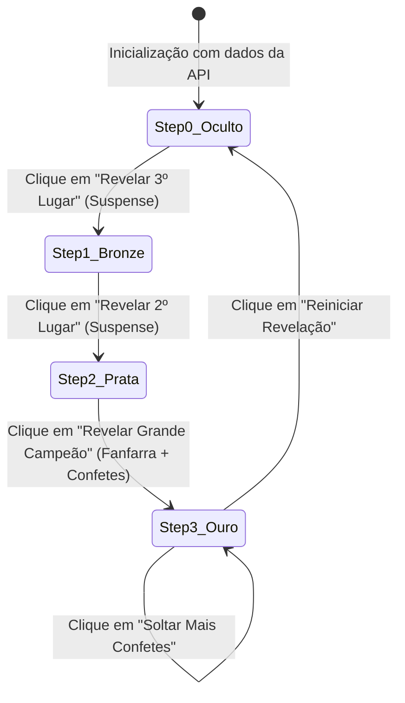
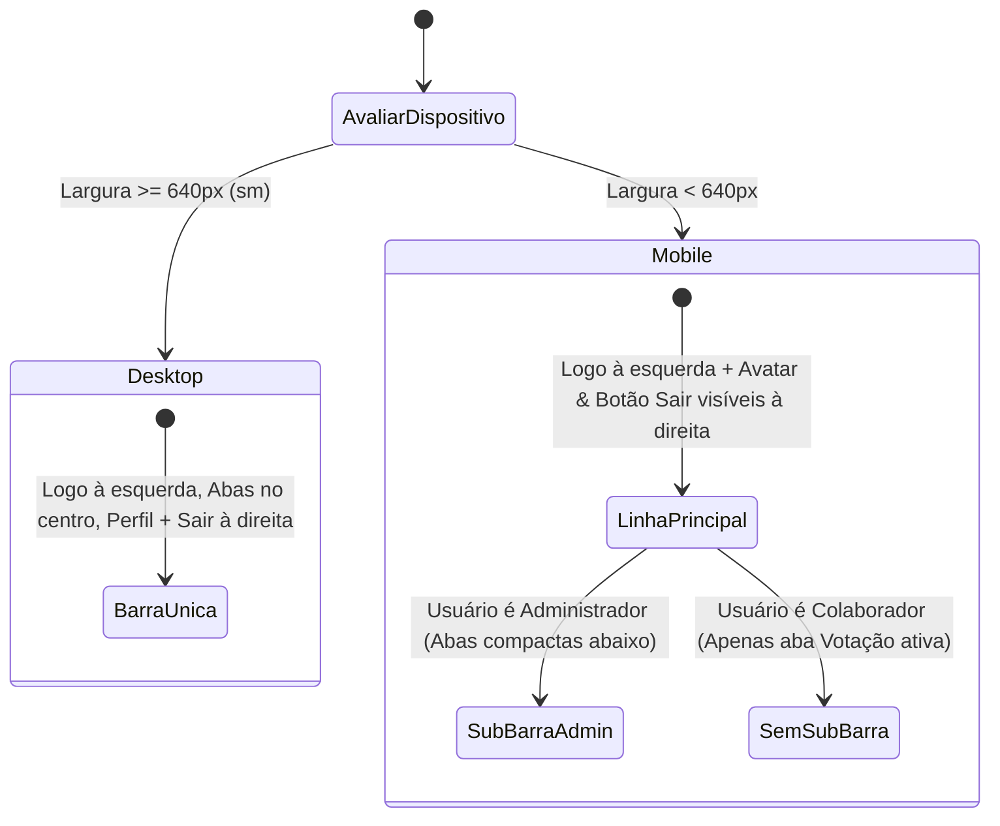

# Data Model & State Architecture: Empates no Pódio e Navbar Mobile

**Feature**: `010-empates-podio-mobile-navbar`  
**Date**: 2026-10-02  
**Status**: Concluído  

---

## 1. Modelo de Entidades e Estruturas de Dados

### 1.1 Entidade: CandidateRankingItem (Apuração no Backend e Admin)

Representa cada candidato dentro do ranking apurado, agora com suporte explícito a posicionamento denso (`place`).

```typescript
interface CandidateRankingItem {
  id: string;             // ID único do candidato (ex: "marina-ribeiro")
  name: string;           // Nome completo do colaborador
  email: string;          // E-mail institucional @colegiocarbonell.com.br
  department: string;     // Departamento / Setor
  photoUrl: string;       // Caminho da foto (/photos/...)
  costumeName: string;    // Nome da fantasia / personagem
  votes: number;          // Total de votos computados
  percentage: number;     // Percentual sobre os votos válidos (ex: 28.5)
  place: number;          // Posição densa calculada (1 para os líderes, 2 para o segundo pelotão, etc.)
}
```

### 1.2 Entidade: PodiumGroup (Degrau do Pódio)

Representa a agregação de colaboradores que ocupam o mesmo degrau do pódio na revelação do telão.

```typescript
interface PodiumGroup {
  place: 1 | 2 | 3;                      // Degrau no pódio
  tier: 'gold' | 'silver' | 'bronze';    // Metal simbólico institucional
  votes: number;                         // Contagem de votos que qualificou o grupo
  percentage: number;                    // Percentual de votos do grupo
  candidates: CandidateRankingItem[];    // 1 ou mais candidatos empatados nessa posição
}

interface PodiumPayload {
  first: CandidateRankingItem[];         // Lista de campeões (1º Lugar - Ouro)
  second: CandidateRankingItem[];        // Lista de vice-campeões (2º Lugar - Prata)
  third: CandidateRankingItem[];         // Lista de 3º colocados (Bronze)
  // Retrocompatibilidade para clientes que leem array plano
  flatPodium?: CandidateRankingItem[];   
}
```

### 1.3 Entidade: MetricsResponse (Payload de `GET /api/admin/metrics`)

Payload consolidado retornado pelo backend para o Painel Admin e o Telão de Revelação.

```typescript
interface MetricsResponse {
  status: 'waiting' | 'open' | 'closed';
  title: string;
  totalVotes: number;
  totalCandidates: number;
  ranking: CandidateRankingItem[];
  podium: {
    first: CandidateRankingItem[];
    second: CandidateRankingItem[];
    third: CandidateRankingItem[];
  };
  auditAttendance: {
    voterName: string;
    voterEmail: string;
    timestamp: string;
  }[];
}
```

---

## 2. Máquina de Estados e Fluxo de Apresentação

### 2.1 Telão de Revelação (`RevealPage.jsx`)



* **Comportamento em Cada Degrau:**
  * Se `candidates.length === 1`: Renderiza avatar em destaque único (128px a 192px).
  * Se `candidates.length > 1`: Renderiza grid flex lado a lado com avatares divididos (80px a 110px), nomes e trajes de cada vencedor, e badge coletivo de empate.

### 2.2 Estados de Layout da Barra de Navegação (`Navbar.jsx`)



---

## 3. Regras de Integridade e Validação

1. **Votos Zero:** Candidatos com `votes === 0` não são elegíveis para nenhum degrau do pódio. Se nenhum candidato tiver votos, os degraus exibem estado neutro de espera.
2. **Dense Ranking Imutável:** Dois ou mais candidatos com a mesma pontuação recebem rigorosamente o mesmo valor de `place`. O próximo degrau numérico é sempre incrementado em exatamente 1 unidade em relação à pontuação imediatamente superior.
3. **Imunidade a Overflow:** O contêiner pai nunca deve ultrapassar `100vw`. Elementos internos que eventualmente tenham conteúdo extenso utilizam `truncate` ou flex wrap controlado.
