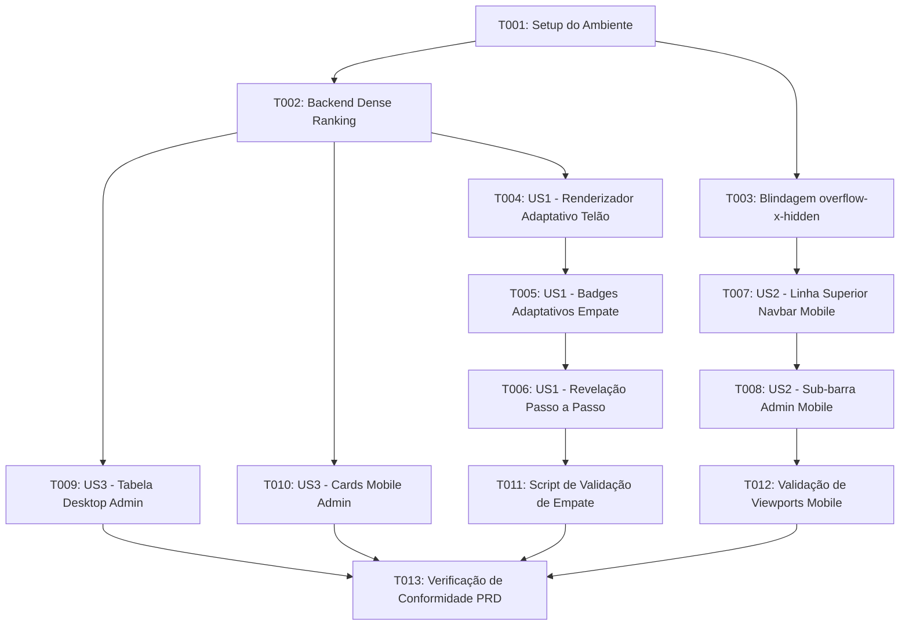

# Tasks: Suporte a Empates Múltiplos no Pódio (Dense Ranking) e Correção de Navegação Mobile (Logout sem Scroll)

**Input**: Documentos de design em `specs/010-empates-podio-mobile-navbar/`  
**Prerequisites**: [plan.md](./plan.md) (obrigatório), [spec.md](./spec.md) (obrigatório), [research.md](./research.md), [data-model.md](./data-model.md), [contracts/api-contracts.md](./contracts/api-contracts.md), [quickstart.md](./quickstart.md)  
**Organization**: Tarefas organizadas por fases e por histórias de usuário para entrega incremental e teste independente.

---

## Format: `[ID] [P?] [Story?] Description`

- **[P]**: Tarefa executável em paralelo (arquivos distintos, sem dependência mútua)
- **[Story]**: Identificador da história de usuário correspondente (`[US1]`, `[US2]`, `[US3]`)
- Caminhos absolutos/relativos de arquivos incluídos em todas as descrições

---

## Phase 1: Setup (Preparação e Validação do Ambiente)

**Propósito**: Preparação do ambiente de desenvolvimento e garantia das dependências necessárias.

- [X] T001 Verificar a branch ativa `antigravity-010/feat-empates-podio-mobile-navbar` e integridade das dependências em `package.json` e `client/package.json`

---

## Phase 2: Foundational (Cálculo de Dense Ranking e Contenção de Layout)

**Propósito**: Componentes essenciais de backend e contenção global de layout que servem de base para as histórias de usuário.

**⚠️ CRITICAL**: Nenhuma história de usuário de frontend pode ser considerada completa sem a conclusão desta fase.

- [X] T002 [P] Implementar algoritmo de *Dense Ranking* com agrupamento de pontuações de topo (`podium: { first, second, third }`) e atribuição da propriedade `place` densa no endpoint `GET /api/admin/metrics` em `server/routes/admin.js`
- [X] T003 [P] Implementar blindagem global contra transbordamento horizontal adicionando `overflow-x-hidden` no layout raiz em `client/src/App.jsx` e na camada base em `client/src/index.css`

**Checkpoint**: Infraestrutura de dados de empate no backend e contenção de overflow global prontas.

---

## Phase 3: User Story 1 - Exibição Dividida de Empates no Pódio do Telão (Priority: P1) 🎯 MVP

**Goal**: Exibir no telão de revelação todos os colaboradores empatados dividindo harmoniosamente o mesmo degrau do pódio (seja 1º, 2º ou 3º lugar) com layout adaptativo e celebração conjunta.

**Independent Test**: Simular votação com empates (ex.: 4 em 1º, 2 em 2º e 1 em 3º) e verificar em `/revelacao` que o degrau do 1º lugar exibe as 4 fotos lado a lado com badge `"1º LUGAR • 4 CAMPEÕES EMPATADOS"` e chuva de confetes, e o 2º lugar exibe as 2 fotos lado a lado.

- [X] T004 [US1] Criar renderizador adaptativo de degrau do pódio capaz de alternar entre vencedor único (avatar ampliado de 128px a 192px) e múltiplos empatados (container flex horizontal lado a lado com avatares de 80px a 110px, nomes e trajes individuais) em `client/src/pages/RevealPage.jsx`
- [X] T005 [US1] Implementar títulos e badges adaptativos para empates (`1º LUGAR • {N} CAMPEÕES EMPATADOS`, `2º LUGAR • EMPATE`, `3º LUGAR • EMPATE`) em `client/src/pages/RevealPage.jsx`
- [X] T006 [US1] Ajustar os botões de controle passo a passo do apresentador para revelar conjuntamente todos os participantes do degrau selecionado com os efeitos sonoros correspondentes e fanfarra/confetes em tela cheia no 1º lugar em `client/src/pages/RevealPage.jsx`

**Checkpoint**: User Story 1 completa e testável de forma independente. Telão suporta empates múltiplos com visual cinematográfico.

---

## Phase 4: User Story 2 - Visibilidade Permanente do Botão "Sair" no Mobile sem Scroll Horizontal (Priority: P1)

**Goal**: Garantir que em smartphones (< 640px) o botão "Sair" e o Avatar estejam 100% visíveis no canto superior direito por padrão, sem qualquer necessidade de rolagem horizontal.

**Independent Test**: Acessar o sistema em tela de celular (360px a 390px) logado como administrador. Constatar que a página não possui rolagem horizontal e que o botão "Sair" e o Avatar estão visíveis e clicáveis imediatamente, enquanto as abas de administração estão organizadas em sub-barra dedicada.

- [X] T007 [US2] Reestruturar a linha superior da `Navbar` para manter no mobile (< 640px) exclusivamente o logotipo institucional compacto à esquerda e o conjunto Avatar + Botão "Sair" (`LogOut`) fixos e visíveis à direita sem transbordamento em `client/src/components/Navbar.jsx`
- [X] T008 [US2] Implementar sub-barra secundária compacta de navegação (`bg-[#141d36]`) logo abaixo do cabeçalho no mobile (< 640px) para renderizar as abas de alternância de administração ("Votação", "Admin", "Telão") com toques acessíveis de 44x44px em `client/src/components/Navbar.jsx`

**Checkpoint**: User Story 2 completa. Usabilidade mobile perfeita sem rolagem lateral e com logout acessível.

---

## Phase 5: User Story 3 - Apuração Densa e Medalhas Alinhadas no Painel Administrativo (Priority: P2)

**Goal**: Garantir consistência absoluta entre a apuração do Painel Admin e o telão, exibindo as mesmas medalhas e posições numéricas para candidatos empatados.

**Independent Test**: Consultar o ranking no Painel Admin durante empate e verificar que todos os empatados na 1ª pontuação recebem o selo de 1º lugar com troféu, os da 2ª pontuação recebem o selo de 2º lugar, e os da 3ª pontuação recebem o selo de 3º lugar.

- [X] T009 [P] [US3] Atualizar a tabela de apuração geral desktop no painel administrativo para exibir a mesma medalha e número de colocação (`place`) para candidatos empatados em `client/src/pages/AdminPage.jsx`
- [X] T010 [P] [US3] Atualizar os cards verticais de apuração mobile para refletir a colocação de empate com badges e troféus correspondentes em `client/src/pages/AdminPage.jsx`

**Checkpoint**: User Story 3 completa. Consistência total entre painel de auditoria e telão.

---

## Phase 6: Polish & Validação Integrada

**Propósito**: Validação final de ponta a ponta com simulação de empates e verificação em dispositivos móveis.

- [X] T011 Criar script de teste automatizado de ranking e empate em `server/scripts/testRankingTie.js` validando a agregação de múltiplos empates nos 3 degraus
- [X] T012 Executar testes de validação funcional e visual em viewports móveis simuladas (360px, 375px, 414px) comprovando zero scroll horizontal e botão de logout 100% visível
- [X] T013 Validar aderência rigorosa a todos os critérios estabelecidos no [PRD_Final.md](../../PRD_Final.md) e [DESIGN_SYSTEM_PRD.md](../../DESIGN_SYSTEM_PRD.md)

---

## Dependencies & Execution Graph

---

## Parallel Execution Opportunities

- **Paralelismo 1 (Backend vs Layout Raiz):** `T002` (Backend `admin.js`) pode rodar em paralelo com `T003` (CSS e layout em `App.jsx` / `index.css`).
- **Paralelismo 2 (US1 Telão vs US2 Navbar):** Uma vez concluídas as tarefas fundamentais, `T004` (Telão) e `T007` (Navbar) operam em componentes totalmente independentes.
- **Paralelismo 3 (US3 Tabela Desktop vs Cards Mobile):** `T009` e `T010` podem ser implementados e verificados de forma paralela em `AdminPage.jsx`.

---

## Implementation Strategy (MVP Incremental)

1. **Incremento 1 (Foundational + US1 - MVP Telão):**
   - Implementar Dense Ranking no backend (`T002`) e o pódio adaptativo no telão (`T004` - `T006`).
   - O telão já passa a celebrar empates com justiça e impacto visual.
2. **Incremento 2 (US2 - Ergonomia Mobile):**
   - Implementar a sub-barra da Navbar e a contenção contra scroll horizontal (`T003`, `T007`, `T008`).
   - Corrige o problema do botão "Sair" escondido no mobile.
3. **Incremento 3 (US3 - Alinhamento Admin):**
   - Ajustar os badges na apuração (`T009`, `T010`).
4. **Incremento 4 (Polish & Validação):**
   - Bateria de testes automatizados e verificação de conformidade (`T011` - `T013`).
